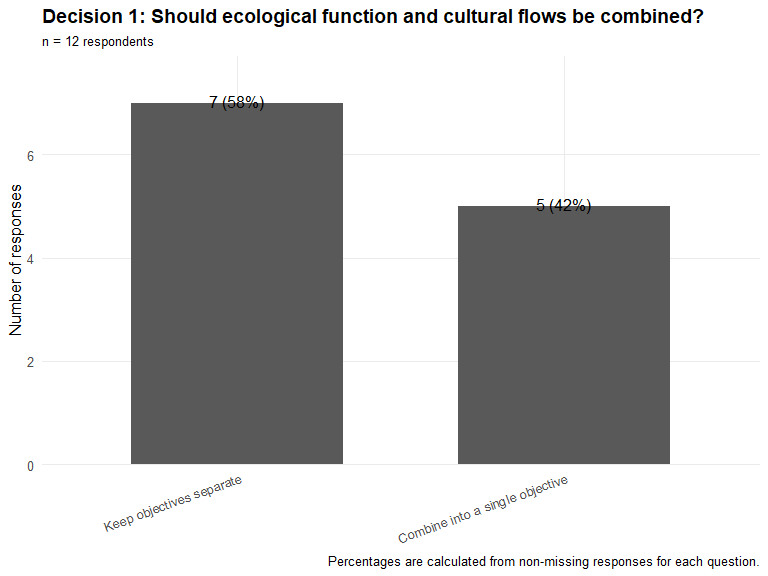
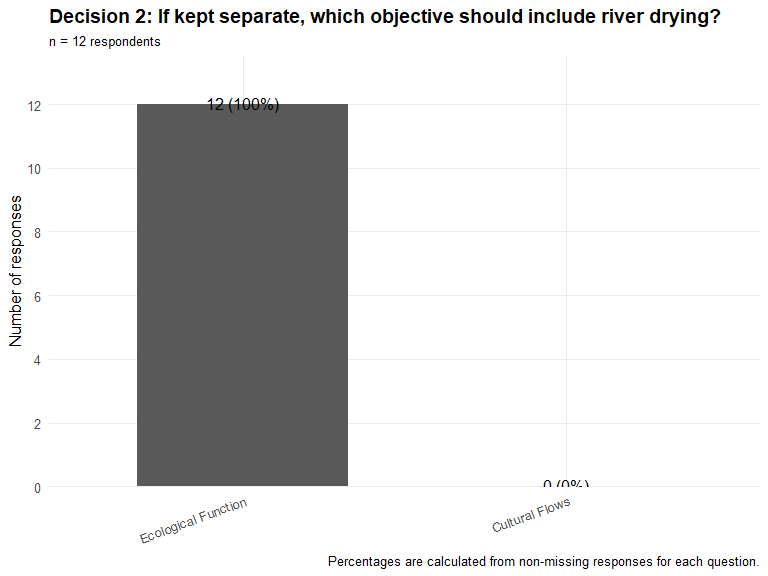
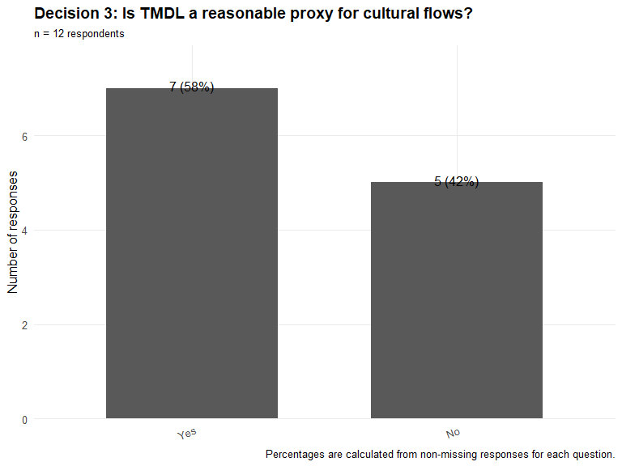
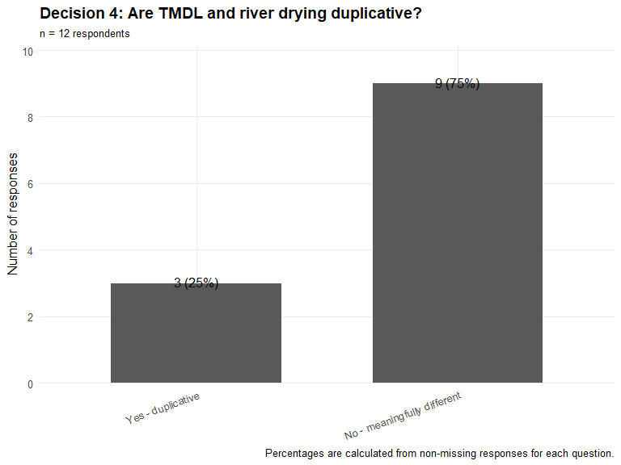
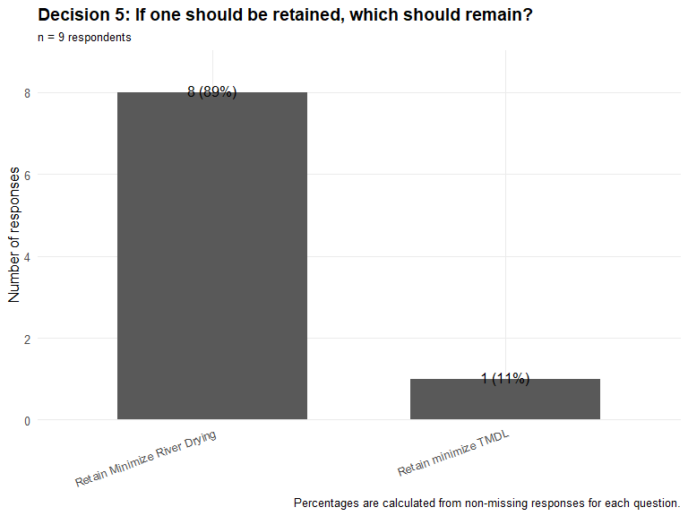

# Overview

This report summarizes responses from the Webinar 2 survey for the RGSM Options Tool. It includes participant information, response rates, closed-ended question summaries, plots for the choice questions, and tables of open-ended responses.


```{=html}
<div id="vjawvbkjde" style="padding-left:0px;padding-right:0px;padding-top:10px;padding-bottom:10px;overflow-x:auto;overflow-y:auto;width:auto;height:auto;">
<style>#vjawvbkjde table {
  font-family: system-ui, 'Segoe UI', Roboto, Helvetica, Arial, sans-serif, 'Apple Color Emoji', 'Segoe UI Emoji', 'Segoe UI Symbol', 'Noto Color Emoji';
  -webkit-font-smoothing: antialiased;
  -moz-osx-font-smoothing: grayscale;
}

#vjawvbkjde thead, #vjawvbkjde tbody, #vjawvbkjde tfoot, #vjawvbkjde tr, #vjawvbkjde td, #vjawvbkjde th {
  border-style: none;
}

#vjawvbkjde p {
  margin: 0;
  padding: 0;
}

#vjawvbkjde .gt_table {
  display: table;
  border-collapse: collapse;
  line-height: normal;
  margin-left: auto;
  margin-right: auto;
  color: #333333;
  font-size: 16px;
  font-weight: normal;
  font-style: normal;
  background-color: #FFFFFF;
  width: auto;
  border-top-style: solid;
  border-top-width: 2px;
  border-top-color: #A8A8A8;
  border-right-style: none;
  border-right-width: 2px;
  border-right-color: #D3D3D3;
  border-bottom-style: solid;
  border-bottom-width: 2px;
  border-bottom-color: #A8A8A8;
  border-left-style: none;
  border-left-width: 2px;
  border-left-color: #D3D3D3;
}

#vjawvbkjde .gt_caption {
  padding-top: 4px;
  padding-bottom: 4px;
}

#vjawvbkjde .gt_title {
  color: #333333;
  font-size: 125%;
  font-weight: initial;
  padding-top: 4px;
  padding-bottom: 4px;
  padding-left: 5px;
  padding-right: 5px;
  border-bottom-color: #FFFFFF;
  border-bottom-width: 0;
}

#vjawvbkjde .gt_subtitle {
  color: #333333;
  font-size: 85%;
  font-weight: initial;
  padding-top: 3px;
  padding-bottom: 5px;
  padding-left: 5px;
  padding-right: 5px;
  border-top-color: #FFFFFF;
  border-top-width: 0;
}

#vjawvbkjde .gt_heading {
  background-color: #FFFFFF;
  text-align: center;
  border-bottom-color: #FFFFFF;
  border-left-style: none;
  border-left-width: 1px;
  border-left-color: #D3D3D3;
  border-right-style: none;
  border-right-width: 1px;
  border-right-color: #D3D3D3;
}

#vjawvbkjde .gt_bottom_border {
  border-bottom-style: solid;
  border-bottom-width: 2px;
  border-bottom-color: #D3D3D3;
}

#vjawvbkjde .gt_col_headings {
  border-top-style: solid;
  border-top-width: 2px;
  border-top-color: #D3D3D3;
  border-bottom-style: solid;
  border-bottom-width: 2px;
  border-bottom-color: #D3D3D3;
  border-left-style: none;
  border-left-width: 1px;
  border-left-color: #D3D3D3;
  border-right-style: none;
  border-right-width: 1px;
  border-right-color: #D3D3D3;
}

#vjawvbkjde .gt_col_heading {
  color: #333333;
  background-color: #FFFFFF;
  font-size: 100%;
  font-weight: normal;
  text-transform: inherit;
  border-left-style: none;
  border-left-width: 1px;
  border-left-color: #D3D3D3;
  border-right-style: none;
  border-right-width: 1px;
  border-right-color: #D3D3D3;
  vertical-align: bottom;
  padding-top: 5px;
  padding-bottom: 6px;
  padding-left: 5px;
  padding-right: 5px;
  overflow-x: hidden;
}

#vjawvbkjde .gt_column_spanner_outer {
  color: #333333;
  background-color: #FFFFFF;
  font-size: 100%;
  font-weight: normal;
  text-transform: inherit;
  padding-top: 0;
  padding-bottom: 0;
  padding-left: 4px;
  padding-right: 4px;
}

#vjawvbkjde .gt_column_spanner_outer:first-child {
  padding-left: 0;
}

#vjawvbkjde .gt_column_spanner_outer:last-child {
  padding-right: 0;
}

#vjawvbkjde .gt_column_spanner {
  border-bottom-style: solid;
  border-bottom-width: 2px;
  border-bottom-color: #D3D3D3;
  vertical-align: bottom;
  padding-top: 5px;
  padding-bottom: 5px;
  overflow-x: hidden;
  display: inline-block;
  width: 100%;
}

#vjawvbkjde .gt_spanner_row {
  border-bottom-style: hidden;
}

#vjawvbkjde .gt_group_heading {
  padding-top: 8px;
  padding-bottom: 8px;
  padding-left: 5px;
  padding-right: 5px;
  color: #333333;
  background-color: #FFFFFF;
  font-size: 100%;
  font-weight: initial;
  text-transform: inherit;
  border-top-style: solid;
  border-top-width: 2px;
  border-top-color: #D3D3D3;
  border-bottom-style: solid;
  border-bottom-width: 2px;
  border-bottom-color: #D3D3D3;
  border-left-style: none;
  border-left-width: 1px;
  border-left-color: #D3D3D3;
  border-right-style: none;
  border-right-width: 1px;
  border-right-color: #D3D3D3;
  vertical-align: middle;
  text-align: left;
}

#vjawvbkjde .gt_empty_group_heading {
  padding: 0.5px;
  color: #333333;
  background-color: #FFFFFF;
  font-size: 100%;
  font-weight: initial;
  border-top-style: solid;
  border-top-width: 2px;
  border-top-color: #D3D3D3;
  border-bottom-style: solid;
  border-bottom-width: 2px;
  border-bottom-color: #D3D3D3;
  vertical-align: middle;
}

#vjawvbkjde .gt_from_md > :first-child {
  margin-top: 0;
}

#vjawvbkjde .gt_from_md > :last-child {
  margin-bottom: 0;
}

#vjawvbkjde .gt_row {
  padding-top: 8px;
  padding-bottom: 8px;
  padding-left: 5px;
  padding-right: 5px;
  margin: 10px;
  border-top-style: solid;
  border-top-width: 1px;
  border-top-color: #D3D3D3;
  border-left-style: none;
  border-left-width: 1px;
  border-left-color: #D3D3D3;
  border-right-style: none;
  border-right-width: 1px;
  border-right-color: #D3D3D3;
  vertical-align: middle;
  overflow-x: hidden;
}

#vjawvbkjde .gt_stub {
  color: #333333;
  background-color: #FFFFFF;
  font-size: 100%;
  font-weight: initial;
  text-transform: inherit;
  border-right-style: solid;
  border-right-width: 2px;
  border-right-color: #D3D3D3;
  padding-left: 5px;
  padding-right: 5px;
}

#vjawvbkjde .gt_stub_row_group {
  color: #333333;
  background-color: #FFFFFF;
  font-size: 100%;
  font-weight: initial;
  text-transform: inherit;
  border-right-style: solid;
  border-right-width: 2px;
  border-right-color: #D3D3D3;
  padding-left: 5px;
  padding-right: 5px;
  vertical-align: top;
}

#vjawvbkjde .gt_row_group_first td {
  border-top-width: 2px;
}

#vjawvbkjde .gt_row_group_first th {
  border-top-width: 2px;
}

#vjawvbkjde .gt_summary_row {
  color: #333333;
  background-color: #FFFFFF;
  text-transform: inherit;
  padding-top: 8px;
  padding-bottom: 8px;
  padding-left: 5px;
  padding-right: 5px;
}

#vjawvbkjde .gt_first_summary_row {
  border-top-style: solid;
  border-top-color: #D3D3D3;
}

#vjawvbkjde .gt_first_summary_row.thick {
  border-top-width: 2px;
}

#vjawvbkjde .gt_last_summary_row {
  padding-top: 8px;
  padding-bottom: 8px;
  padding-left: 5px;
  padding-right: 5px;
  border-bottom-style: solid;
  border-bottom-width: 2px;
  border-bottom-color: #D3D3D3;
}

#vjawvbkjde .gt_grand_summary_row {
  color: #333333;
  background-color: #FFFFFF;
  text-transform: inherit;
  padding-top: 8px;
  padding-bottom: 8px;
  padding-left: 5px;
  padding-right: 5px;
}

#vjawvbkjde .gt_first_grand_summary_row {
  padding-top: 8px;
  padding-bottom: 8px;
  padding-left: 5px;
  padding-right: 5px;
  border-top-style: double;
  border-top-width: 6px;
  border-top-color: #D3D3D3;
}

#vjawvbkjde .gt_last_grand_summary_row_top {
  padding-top: 8px;
  padding-bottom: 8px;
  padding-left: 5px;
  padding-right: 5px;
  border-bottom-style: double;
  border-bottom-width: 6px;
  border-bottom-color: #D3D3D3;
}

#vjawvbkjde .gt_striped {
  background-color: rgba(128, 128, 128, 0.05);
}

#vjawvbkjde .gt_table_body {
  border-top-style: solid;
  border-top-width: 2px;
  border-top-color: #D3D3D3;
  border-bottom-style: solid;
  border-bottom-width: 2px;
  border-bottom-color: #D3D3D3;
}

#vjawvbkjde .gt_footnotes {
  color: #333333;
  background-color: #FFFFFF;
  border-bottom-style: none;
  border-bottom-width: 2px;
  border-bottom-color: #D3D3D3;
  border-left-style: none;
  border-left-width: 2px;
  border-left-color: #D3D3D3;
  border-right-style: none;
  border-right-width: 2px;
  border-right-color: #D3D3D3;
}

#vjawvbkjde .gt_footnote {
  margin: 0px;
  font-size: 90%;
  padding-top: 4px;
  padding-bottom: 4px;
  padding-left: 5px;
  padding-right: 5px;
}

#vjawvbkjde .gt_sourcenotes {
  color: #333333;
  background-color: #FFFFFF;
  border-bottom-style: none;
  border-bottom-width: 2px;
  border-bottom-color: #D3D3D3;
  border-left-style: none;
  border-left-width: 2px;
  border-left-color: #D3D3D3;
  border-right-style: none;
  border-right-width: 2px;
  border-right-color: #D3D3D3;
}

#vjawvbkjde .gt_sourcenote {
  font-size: 90%;
  padding-top: 4px;
  padding-bottom: 4px;
  padding-left: 5px;
  padding-right: 5px;
}

#vjawvbkjde .gt_left {
  text-align: left;
}

#vjawvbkjde .gt_center {
  text-align: center;
}

#vjawvbkjde .gt_right {
  text-align: right;
  font-variant-numeric: tabular-nums;
}

#vjawvbkjde .gt_font_normal {
  font-weight: normal;
}

#vjawvbkjde .gt_font_bold {
  font-weight: bold;
}

#vjawvbkjde .gt_font_italic {
  font-style: italic;
}

#vjawvbkjde .gt_super {
  font-size: 65%;
}

#vjawvbkjde .gt_footnote_marks {
  font-size: 75%;
  vertical-align: 0.4em;
  position: initial;
}

#vjawvbkjde .gt_asterisk {
  font-size: 100%;
  vertical-align: 0;
}

#vjawvbkjde .gt_indent_1 {
  text-indent: 5px;
}

#vjawvbkjde .gt_indent_2 {
  text-indent: 10px;
}

#vjawvbkjde .gt_indent_3 {
  text-indent: 15px;
}

#vjawvbkjde .gt_indent_4 {
  text-indent: 20px;
}

#vjawvbkjde .gt_indent_5 {
  text-indent: 25px;
}

#vjawvbkjde .katex-display {
  display: inline-flex !important;
  margin-bottom: 0.75em !important;
}

#vjawvbkjde div.Reactable > div.rt-table > div.rt-thead > div.rt-tr.rt-tr-group-header > div.rt-th-group:after {
  height: 0px !important;
}
</style>
<table class="gt_table" data-quarto-disable-processing="false" data-quarto-bootstrap="false">
  <thead>
    <tr class="gt_heading">
      <td colspan="2" class="gt_heading gt_title gt_font_normal gt_bottom_border" style><span class='gt_from_md'><strong>Survey overview</strong></span></td>
    </tr>
    
    <tr class="gt_col_headings">
      <th class="gt_col_heading gt_columns_bottom_border gt_left" rowspan="1" colspan="1" scope="col" id="Metric">Metric</th>
      <th class="gt_col_heading gt_columns_bottom_border gt_right" rowspan="1" colspan="1" scope="col" id="Value">Value</th>
    </tr>
  </thead>
  <tbody class="gt_table_body">
    <tr><td headers="Metric" class="gt_row gt_left">Total survey responses</td>
<td headers="Value" class="gt_row gt_right">12</td></tr>
    <tr><td headers="Metric" class="gt_row gt_left">Unique participants</td>
<td headers="Value" class="gt_row gt_right">12</td></tr>
    <tr><td headers="Metric" class="gt_row gt_left">Closed-ended questions summarized</td>
<td headers="Value" class="gt_row gt_right">5</td></tr>
    <tr><td headers="Metric" class="gt_row gt_left">Open-ended questions summarized</td>
<td headers="Value" class="gt_row gt_right">3</td></tr>
    <tr><td headers="Metric" class="gt_row gt_left">Two-option charts produced</td>
<td headers="Value" class="gt_row gt_right">5</td></tr>
  </tbody>
  
</table>
</div>
```

# Participant List


```{=html}
<div id="wcgbhpnbim" style="padding-left:0px;padding-right:0px;padding-top:10px;padding-bottom:10px;overflow-x:auto;overflow-y:auto;width:auto;height:auto;">
<style>#wcgbhpnbim table {
  font-family: system-ui, 'Segoe UI', Roboto, Helvetica, Arial, sans-serif, 'Apple Color Emoji', 'Segoe UI Emoji', 'Segoe UI Symbol', 'Noto Color Emoji';
  -webkit-font-smoothing: antialiased;
  -moz-osx-font-smoothing: grayscale;
}

#wcgbhpnbim thead, #wcgbhpnbim tbody, #wcgbhpnbim tfoot, #wcgbhpnbim tr, #wcgbhpnbim td, #wcgbhpnbim th {
  border-style: none;
}

#wcgbhpnbim p {
  margin: 0;
  padding: 0;
}

#wcgbhpnbim .gt_table {
  display: table;
  border-collapse: collapse;
  line-height: normal;
  margin-left: auto;
  margin-right: auto;
  color: #333333;
  font-size: 16px;
  font-weight: normal;
  font-style: normal;
  background-color: #FFFFFF;
  width: auto;
  border-top-style: solid;
  border-top-width: 2px;
  border-top-color: #A8A8A8;
  border-right-style: none;
  border-right-width: 2px;
  border-right-color: #D3D3D3;
  border-bottom-style: solid;
  border-bottom-width: 2px;
  border-bottom-color: #A8A8A8;
  border-left-style: none;
  border-left-width: 2px;
  border-left-color: #D3D3D3;
}

#wcgbhpnbim .gt_caption {
  padding-top: 4px;
  padding-bottom: 4px;
}

#wcgbhpnbim .gt_title {
  color: #333333;
  font-size: 125%;
  font-weight: initial;
  padding-top: 4px;
  padding-bottom: 4px;
  padding-left: 5px;
  padding-right: 5px;
  border-bottom-color: #FFFFFF;
  border-bottom-width: 0;
}

#wcgbhpnbim .gt_subtitle {
  color: #333333;
  font-size: 85%;
  font-weight: initial;
  padding-top: 3px;
  padding-bottom: 5px;
  padding-left: 5px;
  padding-right: 5px;
  border-top-color: #FFFFFF;
  border-top-width: 0;
}

#wcgbhpnbim .gt_heading {
  background-color: #FFFFFF;
  text-align: center;
  border-bottom-color: #FFFFFF;
  border-left-style: none;
  border-left-width: 1px;
  border-left-color: #D3D3D3;
  border-right-style: none;
  border-right-width: 1px;
  border-right-color: #D3D3D3;
}

#wcgbhpnbim .gt_bottom_border {
  border-bottom-style: solid;
  border-bottom-width: 2px;
  border-bottom-color: #D3D3D3;
}

#wcgbhpnbim .gt_col_headings {
  border-top-style: solid;
  border-top-width: 2px;
  border-top-color: #D3D3D3;
  border-bottom-style: solid;
  border-bottom-width: 2px;
  border-bottom-color: #D3D3D3;
  border-left-style: none;
  border-left-width: 1px;
  border-left-color: #D3D3D3;
  border-right-style: none;
  border-right-width: 1px;
  border-right-color: #D3D3D3;
}

#wcgbhpnbim .gt_col_heading {
  color: #333333;
  background-color: #FFFFFF;
  font-size: 100%;
  font-weight: normal;
  text-transform: inherit;
  border-left-style: none;
  border-left-width: 1px;
  border-left-color: #D3D3D3;
  border-right-style: none;
  border-right-width: 1px;
  border-right-color: #D3D3D3;
  vertical-align: bottom;
  padding-top: 5px;
  padding-bottom: 6px;
  padding-left: 5px;
  padding-right: 5px;
  overflow-x: hidden;
}

#wcgbhpnbim .gt_column_spanner_outer {
  color: #333333;
  background-color: #FFFFFF;
  font-size: 100%;
  font-weight: normal;
  text-transform: inherit;
  padding-top: 0;
  padding-bottom: 0;
  padding-left: 4px;
  padding-right: 4px;
}

#wcgbhpnbim .gt_column_spanner_outer:first-child {
  padding-left: 0;
}

#wcgbhpnbim .gt_column_spanner_outer:last-child {
  padding-right: 0;
}

#wcgbhpnbim .gt_column_spanner {
  border-bottom-style: solid;
  border-bottom-width: 2px;
  border-bottom-color: #D3D3D3;
  vertical-align: bottom;
  padding-top: 5px;
  padding-bottom: 5px;
  overflow-x: hidden;
  display: inline-block;
  width: 100%;
}

#wcgbhpnbim .gt_spanner_row {
  border-bottom-style: hidden;
}

#wcgbhpnbim .gt_group_heading {
  padding-top: 8px;
  padding-bottom: 8px;
  padding-left: 5px;
  padding-right: 5px;
  color: #333333;
  background-color: #FFFFFF;
  font-size: 100%;
  font-weight: initial;
  text-transform: inherit;
  border-top-style: solid;
  border-top-width: 2px;
  border-top-color: #D3D3D3;
  border-bottom-style: solid;
  border-bottom-width: 2px;
  border-bottom-color: #D3D3D3;
  border-left-style: none;
  border-left-width: 1px;
  border-left-color: #D3D3D3;
  border-right-style: none;
  border-right-width: 1px;
  border-right-color: #D3D3D3;
  vertical-align: middle;
  text-align: left;
}

#wcgbhpnbim .gt_empty_group_heading {
  padding: 0.5px;
  color: #333333;
  background-color: #FFFFFF;
  font-size: 100%;
  font-weight: initial;
  border-top-style: solid;
  border-top-width: 2px;
  border-top-color: #D3D3D3;
  border-bottom-style: solid;
  border-bottom-width: 2px;
  border-bottom-color: #D3D3D3;
  vertical-align: middle;
}

#wcgbhpnbim .gt_from_md > :first-child {
  margin-top: 0;
}

#wcgbhpnbim .gt_from_md > :last-child {
  margin-bottom: 0;
}

#wcgbhpnbim .gt_row {
  padding-top: 8px;
  padding-bottom: 8px;
  padding-left: 5px;
  padding-right: 5px;
  margin: 10px;
  border-top-style: solid;
  border-top-width: 1px;
  border-top-color: #D3D3D3;
  border-left-style: none;
  border-left-width: 1px;
  border-left-color: #D3D3D3;
  border-right-style: none;
  border-right-width: 1px;
  border-right-color: #D3D3D3;
  vertical-align: middle;
  overflow-x: hidden;
}

#wcgbhpnbim .gt_stub {
  color: #333333;
  background-color: #FFFFFF;
  font-size: 100%;
  font-weight: initial;
  text-transform: inherit;
  border-right-style: solid;
  border-right-width: 2px;
  border-right-color: #D3D3D3;
  padding-left: 5px;
  padding-right: 5px;
}

#wcgbhpnbim .gt_stub_row_group {
  color: #333333;
  background-color: #FFFFFF;
  font-size: 100%;
  font-weight: initial;
  text-transform: inherit;
  border-right-style: solid;
  border-right-width: 2px;
  border-right-color: #D3D3D3;
  padding-left: 5px;
  padding-right: 5px;
  vertical-align: top;
}

#wcgbhpnbim .gt_row_group_first td {
  border-top-width: 2px;
}

#wcgbhpnbim .gt_row_group_first th {
  border-top-width: 2px;
}

#wcgbhpnbim .gt_summary_row {
  color: #333333;
  background-color: #FFFFFF;
  text-transform: inherit;
  padding-top: 8px;
  padding-bottom: 8px;
  padding-left: 5px;
  padding-right: 5px;
}

#wcgbhpnbim .gt_first_summary_row {
  border-top-style: solid;
  border-top-color: #D3D3D3;
}

#wcgbhpnbim .gt_first_summary_row.thick {
  border-top-width: 2px;
}

#wcgbhpnbim .gt_last_summary_row {
  padding-top: 8px;
  padding-bottom: 8px;
  padding-left: 5px;
  padding-right: 5px;
  border-bottom-style: solid;
  border-bottom-width: 2px;
  border-bottom-color: #D3D3D3;
}

#wcgbhpnbim .gt_grand_summary_row {
  color: #333333;
  background-color: #FFFFFF;
  text-transform: inherit;
  padding-top: 8px;
  padding-bottom: 8px;
  padding-left: 5px;
  padding-right: 5px;
}

#wcgbhpnbim .gt_first_grand_summary_row {
  padding-top: 8px;
  padding-bottom: 8px;
  padding-left: 5px;
  padding-right: 5px;
  border-top-style: double;
  border-top-width: 6px;
  border-top-color: #D3D3D3;
}

#wcgbhpnbim .gt_last_grand_summary_row_top {
  padding-top: 8px;
  padding-bottom: 8px;
  padding-left: 5px;
  padding-right: 5px;
  border-bottom-style: double;
  border-bottom-width: 6px;
  border-bottom-color: #D3D3D3;
}

#wcgbhpnbim .gt_striped {
  background-color: rgba(128, 128, 128, 0.05);
}

#wcgbhpnbim .gt_table_body {
  border-top-style: solid;
  border-top-width: 2px;
  border-top-color: #D3D3D3;
  border-bottom-style: solid;
  border-bottom-width: 2px;
  border-bottom-color: #D3D3D3;
}

#wcgbhpnbim .gt_footnotes {
  color: #333333;
  background-color: #FFFFFF;
  border-bottom-style: none;
  border-bottom-width: 2px;
  border-bottom-color: #D3D3D3;
  border-left-style: none;
  border-left-width: 2px;
  border-left-color: #D3D3D3;
  border-right-style: none;
  border-right-width: 2px;
  border-right-color: #D3D3D3;
}

#wcgbhpnbim .gt_footnote {
  margin: 0px;
  font-size: 90%;
  padding-top: 4px;
  padding-bottom: 4px;
  padding-left: 5px;
  padding-right: 5px;
}

#wcgbhpnbim .gt_sourcenotes {
  color: #333333;
  background-color: #FFFFFF;
  border-bottom-style: none;
  border-bottom-width: 2px;
  border-bottom-color: #D3D3D3;
  border-left-style: none;
  border-left-width: 2px;
  border-left-color: #D3D3D3;
  border-right-style: none;
  border-right-width: 2px;
  border-right-color: #D3D3D3;
}

#wcgbhpnbim .gt_sourcenote {
  font-size: 90%;
  padding-top: 4px;
  padding-bottom: 4px;
  padding-left: 5px;
  padding-right: 5px;
}

#wcgbhpnbim .gt_left {
  text-align: left;
}

#wcgbhpnbim .gt_center {
  text-align: center;
}

#wcgbhpnbim .gt_right {
  text-align: right;
  font-variant-numeric: tabular-nums;
}

#wcgbhpnbim .gt_font_normal {
  font-weight: normal;
}

#wcgbhpnbim .gt_font_bold {
  font-weight: bold;
}

#wcgbhpnbim .gt_font_italic {
  font-style: italic;
}

#wcgbhpnbim .gt_super {
  font-size: 65%;
}

#wcgbhpnbim .gt_footnote_marks {
  font-size: 75%;
  vertical-align: 0.4em;
  position: initial;
}

#wcgbhpnbim .gt_asterisk {
  font-size: 100%;
  vertical-align: 0;
}

#wcgbhpnbim .gt_indent_1 {
  text-indent: 5px;
}

#wcgbhpnbim .gt_indent_2 {
  text-indent: 10px;
}

#wcgbhpnbim .gt_indent_3 {
  text-indent: 15px;
}

#wcgbhpnbim .gt_indent_4 {
  text-indent: 20px;
}

#wcgbhpnbim .gt_indent_5 {
  text-indent: 25px;
}

#wcgbhpnbim .katex-display {
  display: inline-flex !important;
  margin-bottom: 0.75em !important;
}

#wcgbhpnbim div.Reactable > div.rt-table > div.rt-thead > div.rt-tr.rt-tr-group-header > div.rt-th-group:after {
  height: 0px !important;
}
</style>
<table class="gt_table" data-quarto-disable-processing="false" data-quarto-bootstrap="false">
  <thead>
    <tr class="gt_heading">
      <td colspan="3" class="gt_heading gt_title gt_font_normal gt_bottom_border" style><span class='gt_from_md'><strong>Participants</strong></span></td>
    </tr>
    
    <tr class="gt_col_headings">
      <th class="gt_col_heading gt_columns_bottom_border gt_left" rowspan="1" colspan="1" scope="col" id="first_name">First name</th>
      <th class="gt_col_heading gt_columns_bottom_border gt_left" rowspan="1" colspan="1" scope="col" id="last_name">Last name</th>
      <th class="gt_col_heading gt_columns_bottom_border gt_left" rowspan="1" colspan="1" scope="col" id="full_name">Full name</th>
    </tr>
  </thead>
  <tbody class="gt_table_body">
    <tr><td headers="first_name" class="gt_row gt_left">Thomas</td>
<td headers="last_name" class="gt_row gt_left">Archdeacon</td>
<td headers="full_name" class="gt_row gt_left">Thomas Archdeacon</td></tr>
    <tr><td headers="first_name" class="gt_row gt_left">Jen</td>
<td headers="last_name" class="gt_row gt_left">Bachus</td>
<td headers="full_name" class="gt_row gt_left">Jen Bachus</td></tr>
    <tr><td headers="first_name" class="gt_row gt_left">Lucas</td>
<td headers="last_name" class="gt_row gt_left">Barrett</td>
<td headers="full_name" class="gt_row gt_left">Lucas Barrett</td></tr>
    <tr><td headers="first_name" class="gt_row gt_left">Andy</td>
<td headers="last_name" class="gt_row gt_left">Dean</td>
<td headers="full_name" class="gt_row gt_left">Andy Dean</td></tr>
    <tr><td headers="first_name" class="gt_row gt_left">Carolyn</td>
<td headers="last_name" class="gt_row gt_left">Donnelly</td>
<td headers="full_name" class="gt_row gt_left">Carolyn Donnelly</td></tr>
    <tr><td headers="first_name" class="gt_row gt_left">Eric</td>
<td headers="last_name" class="gt_row gt_left">Gonzales</td>
<td headers="full_name" class="gt_row gt_left">Eric Gonzales</td></tr>
    <tr><td headers="first_name" class="gt_row gt_left">Grace</td>
<td headers="last_name" class="gt_row gt_left">Haggerty</td>
<td headers="full_name" class="gt_row gt_left">Grace Haggerty</td></tr>
    <tr><td headers="first_name" class="gt_row gt_left">Aubrey</td>
<td headers="last_name" class="gt_row gt_left">Harris</td>
<td headers="full_name" class="gt_row gt_left">Aubrey Harris</td></tr>
    <tr><td headers="first_name" class="gt_row gt_left">Debra</td>
<td headers="last_name" class="gt_row gt_left">Hill</td>
<td headers="full_name" class="gt_row gt_left">Debra Hill</td></tr>
    <tr><td headers="first_name" class="gt_row gt_left">Casey</td>
<td headers="last_name" class="gt_row gt_left">Ish</td>
<td headers="full_name" class="gt_row gt_left">Casey Ish</td></tr>
    <tr><td headers="first_name" class="gt_row gt_left">Anne</td>
<td headers="last_name" class="gt_row gt_left">Marken</td>
<td headers="full_name" class="gt_row gt_left">Anne Marken</td></tr>
    <tr><td headers="first_name" class="gt_row gt_left">Michael</td>
<td headers="last_name" class="gt_row gt_left">Porter</td>
<td headers="full_name" class="gt_row gt_left">Michael Porter</td></tr>
  </tbody>
  
</table>
</div>
```

# Response Rate by Question


```{=html}
<div id="zvxzitqpxe" style="padding-left:0px;padding-right:0px;padding-top:10px;padding-bottom:10px;overflow-x:auto;overflow-y:auto;width:auto;height:auto;">
<style>#zvxzitqpxe table {
  font-family: system-ui, 'Segoe UI', Roboto, Helvetica, Arial, sans-serif, 'Apple Color Emoji', 'Segoe UI Emoji', 'Segoe UI Symbol', 'Noto Color Emoji';
  -webkit-font-smoothing: antialiased;
  -moz-osx-font-smoothing: grayscale;
}

#zvxzitqpxe thead, #zvxzitqpxe tbody, #zvxzitqpxe tfoot, #zvxzitqpxe tr, #zvxzitqpxe td, #zvxzitqpxe th {
  border-style: none;
}

#zvxzitqpxe p {
  margin: 0;
  padding: 0;
}

#zvxzitqpxe .gt_table {
  display: table;
  border-collapse: collapse;
  line-height: normal;
  margin-left: auto;
  margin-right: auto;
  color: #333333;
  font-size: 16px;
  font-weight: normal;
  font-style: normal;
  background-color: #FFFFFF;
  width: auto;
  border-top-style: solid;
  border-top-width: 2px;
  border-top-color: #A8A8A8;
  border-right-style: none;
  border-right-width: 2px;
  border-right-color: #D3D3D3;
  border-bottom-style: solid;
  border-bottom-width: 2px;
  border-bottom-color: #A8A8A8;
  border-left-style: none;
  border-left-width: 2px;
  border-left-color: #D3D3D3;
}

#zvxzitqpxe .gt_caption {
  padding-top: 4px;
  padding-bottom: 4px;
}

#zvxzitqpxe .gt_title {
  color: #333333;
  font-size: 125%;
  font-weight: initial;
  padding-top: 4px;
  padding-bottom: 4px;
  padding-left: 5px;
  padding-right: 5px;
  border-bottom-color: #FFFFFF;
  border-bottom-width: 0;
}

#zvxzitqpxe .gt_subtitle {
  color: #333333;
  font-size: 85%;
  font-weight: initial;
  padding-top: 3px;
  padding-bottom: 5px;
  padding-left: 5px;
  padding-right: 5px;
  border-top-color: #FFFFFF;
  border-top-width: 0;
}

#zvxzitqpxe .gt_heading {
  background-color: #FFFFFF;
  text-align: center;
  border-bottom-color: #FFFFFF;
  border-left-style: none;
  border-left-width: 1px;
  border-left-color: #D3D3D3;
  border-right-style: none;
  border-right-width: 1px;
  border-right-color: #D3D3D3;
}

#zvxzitqpxe .gt_bottom_border {
  border-bottom-style: solid;
  border-bottom-width: 2px;
  border-bottom-color: #D3D3D3;
}

#zvxzitqpxe .gt_col_headings {
  border-top-style: solid;
  border-top-width: 2px;
  border-top-color: #D3D3D3;
  border-bottom-style: solid;
  border-bottom-width: 2px;
  border-bottom-color: #D3D3D3;
  border-left-style: none;
  border-left-width: 1px;
  border-left-color: #D3D3D3;
  border-right-style: none;
  border-right-width: 1px;
  border-right-color: #D3D3D3;
}

#zvxzitqpxe .gt_col_heading {
  color: #333333;
  background-color: #FFFFFF;
  font-size: 100%;
  font-weight: normal;
  text-transform: inherit;
  border-left-style: none;
  border-left-width: 1px;
  border-left-color: #D3D3D3;
  border-right-style: none;
  border-right-width: 1px;
  border-right-color: #D3D3D3;
  vertical-align: bottom;
  padding-top: 5px;
  padding-bottom: 6px;
  padding-left: 5px;
  padding-right: 5px;
  overflow-x: hidden;
}

#zvxzitqpxe .gt_column_spanner_outer {
  color: #333333;
  background-color: #FFFFFF;
  font-size: 100%;
  font-weight: normal;
  text-transform: inherit;
  padding-top: 0;
  padding-bottom: 0;
  padding-left: 4px;
  padding-right: 4px;
}

#zvxzitqpxe .gt_column_spanner_outer:first-child {
  padding-left: 0;
}

#zvxzitqpxe .gt_column_spanner_outer:last-child {
  padding-right: 0;
}

#zvxzitqpxe .gt_column_spanner {
  border-bottom-style: solid;
  border-bottom-width: 2px;
  border-bottom-color: #D3D3D3;
  vertical-align: bottom;
  padding-top: 5px;
  padding-bottom: 5px;
  overflow-x: hidden;
  display: inline-block;
  width: 100%;
}

#zvxzitqpxe .gt_spanner_row {
  border-bottom-style: hidden;
}

#zvxzitqpxe .gt_group_heading {
  padding-top: 8px;
  padding-bottom: 8px;
  padding-left: 5px;
  padding-right: 5px;
  color: #333333;
  background-color: #FFFFFF;
  font-size: 100%;
  font-weight: initial;
  text-transform: inherit;
  border-top-style: solid;
  border-top-width: 2px;
  border-top-color: #D3D3D3;
  border-bottom-style: solid;
  border-bottom-width: 2px;
  border-bottom-color: #D3D3D3;
  border-left-style: none;
  border-left-width: 1px;
  border-left-color: #D3D3D3;
  border-right-style: none;
  border-right-width: 1px;
  border-right-color: #D3D3D3;
  vertical-align: middle;
  text-align: left;
}

#zvxzitqpxe .gt_empty_group_heading {
  padding: 0.5px;
  color: #333333;
  background-color: #FFFFFF;
  font-size: 100%;
  font-weight: initial;
  border-top-style: solid;
  border-top-width: 2px;
  border-top-color: #D3D3D3;
  border-bottom-style: solid;
  border-bottom-width: 2px;
  border-bottom-color: #D3D3D3;
  vertical-align: middle;
}

#zvxzitqpxe .gt_from_md > :first-child {
  margin-top: 0;
}

#zvxzitqpxe .gt_from_md > :last-child {
  margin-bottom: 0;
}

#zvxzitqpxe .gt_row {
  padding-top: 8px;
  padding-bottom: 8px;
  padding-left: 5px;
  padding-right: 5px;
  margin: 10px;
  border-top-style: solid;
  border-top-width: 1px;
  border-top-color: #D3D3D3;
  border-left-style: none;
  border-left-width: 1px;
  border-left-color: #D3D3D3;
  border-right-style: none;
  border-right-width: 1px;
  border-right-color: #D3D3D3;
  vertical-align: middle;
  overflow-x: hidden;
}

#zvxzitqpxe .gt_stub {
  color: #333333;
  background-color: #FFFFFF;
  font-size: 100%;
  font-weight: initial;
  text-transform: inherit;
  border-right-style: solid;
  border-right-width: 2px;
  border-right-color: #D3D3D3;
  padding-left: 5px;
  padding-right: 5px;
}

#zvxzitqpxe .gt_stub_row_group {
  color: #333333;
  background-color: #FFFFFF;
  font-size: 100%;
  font-weight: initial;
  text-transform: inherit;
  border-right-style: solid;
  border-right-width: 2px;
  border-right-color: #D3D3D3;
  padding-left: 5px;
  padding-right: 5px;
  vertical-align: top;
}

#zvxzitqpxe .gt_row_group_first td {
  border-top-width: 2px;
}

#zvxzitqpxe .gt_row_group_first th {
  border-top-width: 2px;
}

#zvxzitqpxe .gt_summary_row {
  color: #333333;
  background-color: #FFFFFF;
  text-transform: inherit;
  padding-top: 8px;
  padding-bottom: 8px;
  padding-left: 5px;
  padding-right: 5px;
}

#zvxzitqpxe .gt_first_summary_row {
  border-top-style: solid;
  border-top-color: #D3D3D3;
}

#zvxzitqpxe .gt_first_summary_row.thick {
  border-top-width: 2px;
}

#zvxzitqpxe .gt_last_summary_row {
  padding-top: 8px;
  padding-bottom: 8px;
  padding-left: 5px;
  padding-right: 5px;
  border-bottom-style: solid;
  border-bottom-width: 2px;
  border-bottom-color: #D3D3D3;
}

#zvxzitqpxe .gt_grand_summary_row {
  color: #333333;
  background-color: #FFFFFF;
  text-transform: inherit;
  padding-top: 8px;
  padding-bottom: 8px;
  padding-left: 5px;
  padding-right: 5px;
}

#zvxzitqpxe .gt_first_grand_summary_row {
  padding-top: 8px;
  padding-bottom: 8px;
  padding-left: 5px;
  padding-right: 5px;
  border-top-style: double;
  border-top-width: 6px;
  border-top-color: #D3D3D3;
}

#zvxzitqpxe .gt_last_grand_summary_row_top {
  padding-top: 8px;
  padding-bottom: 8px;
  padding-left: 5px;
  padding-right: 5px;
  border-bottom-style: double;
  border-bottom-width: 6px;
  border-bottom-color: #D3D3D3;
}

#zvxzitqpxe .gt_striped {
  background-color: rgba(128, 128, 128, 0.05);
}

#zvxzitqpxe .gt_table_body {
  border-top-style: solid;
  border-top-width: 2px;
  border-top-color: #D3D3D3;
  border-bottom-style: solid;
  border-bottom-width: 2px;
  border-bottom-color: #D3D3D3;
}

#zvxzitqpxe .gt_footnotes {
  color: #333333;
  background-color: #FFFFFF;
  border-bottom-style: none;
  border-bottom-width: 2px;
  border-bottom-color: #D3D3D3;
  border-left-style: none;
  border-left-width: 2px;
  border-left-color: #D3D3D3;
  border-right-style: none;
  border-right-width: 2px;
  border-right-color: #D3D3D3;
}

#zvxzitqpxe .gt_footnote {
  margin: 0px;
  font-size: 90%;
  padding-top: 4px;
  padding-bottom: 4px;
  padding-left: 5px;
  padding-right: 5px;
}

#zvxzitqpxe .gt_sourcenotes {
  color: #333333;
  background-color: #FFFFFF;
  border-bottom-style: none;
  border-bottom-width: 2px;
  border-bottom-color: #D3D3D3;
  border-left-style: none;
  border-left-width: 2px;
  border-left-color: #D3D3D3;
  border-right-style: none;
  border-right-width: 2px;
  border-right-color: #D3D3D3;
}

#zvxzitqpxe .gt_sourcenote {
  font-size: 90%;
  padding-top: 4px;
  padding-bottom: 4px;
  padding-left: 5px;
  padding-right: 5px;
}

#zvxzitqpxe .gt_left {
  text-align: left;
}

#zvxzitqpxe .gt_center {
  text-align: center;
}

#zvxzitqpxe .gt_right {
  text-align: right;
  font-variant-numeric: tabular-nums;
}

#zvxzitqpxe .gt_font_normal {
  font-weight: normal;
}

#zvxzitqpxe .gt_font_bold {
  font-weight: bold;
}

#zvxzitqpxe .gt_font_italic {
  font-style: italic;
}

#zvxzitqpxe .gt_super {
  font-size: 65%;
}

#zvxzitqpxe .gt_footnote_marks {
  font-size: 75%;
  vertical-align: 0.4em;
  position: initial;
}

#zvxzitqpxe .gt_asterisk {
  font-size: 100%;
  vertical-align: 0;
}

#zvxzitqpxe .gt_indent_1 {
  text-indent: 5px;
}

#zvxzitqpxe .gt_indent_2 {
  text-indent: 10px;
}

#zvxzitqpxe .gt_indent_3 {
  text-indent: 15px;
}

#zvxzitqpxe .gt_indent_4 {
  text-indent: 20px;
}

#zvxzitqpxe .gt_indent_5 {
  text-indent: 25px;
}

#zvxzitqpxe .katex-display {
  display: inline-flex !important;
  margin-bottom: 0.75em !important;
}

#zvxzitqpxe div.Reactable > div.rt-table > div.rt-thead > div.rt-tr.rt-tr-group-header > div.rt-th-group:after {
  height: 0px !important;
}
</style>
<table class="gt_table" data-quarto-disable-processing="false" data-quarto-bootstrap="false">
  <thead>
    <tr class="gt_heading">
      <td colspan="4" class="gt_heading gt_title gt_font_normal gt_bottom_border" style><span class='gt_from_md'><strong>Response rate by question</strong></span></td>
    </tr>
    
    <tr class="gt_col_headings">
      <th class="gt_col_heading gt_columns_bottom_border gt_left" rowspan="1" colspan="1" scope="col" id="question_label">Question</th>
      <th class="gt_col_heading gt_columns_bottom_border gt_right" rowspan="1" colspan="1" scope="col" id="responses_non_missing">Responses</th>
      <th class="gt_col_heading gt_columns_bottom_border gt_right" rowspan="1" colspan="1" scope="col" id="total_participants">Total participants</th>
      <th class="gt_col_heading gt_columns_bottom_border gt_right" rowspan="1" colspan="1" scope="col" id="response_rate">Response rate</th>
    </tr>
  </thead>
  <tbody class="gt_table_body">
    <tr><td headers="question_label" class="gt_row gt_left">Decision 1: Should ecological function and cultural flows be combined?</td>
<td headers="responses_non_missing" class="gt_row gt_right">12</td>
<td headers="total_participants" class="gt_row gt_right">12</td>
<td headers="response_rate" class="gt_row gt_right">100.0%</td></tr>
    <tr><td headers="question_label" class="gt_row gt_left">Decision 2: If kept separate, which objective should include river drying?</td>
<td headers="responses_non_missing" class="gt_row gt_right">12</td>
<td headers="total_participants" class="gt_row gt_right">12</td>
<td headers="response_rate" class="gt_row gt_right">100.0%</td></tr>
    <tr><td headers="question_label" class="gt_row gt_left">Decision 3: Is TMDL a reasonable proxy for cultural flows?</td>
<td headers="responses_non_missing" class="gt_row gt_right">12</td>
<td headers="total_participants" class="gt_row gt_right">12</td>
<td headers="response_rate" class="gt_row gt_right">100.0%</td></tr>
    <tr><td headers="question_label" class="gt_row gt_left">Decision 4: Are TMDL and river drying duplicative?</td>
<td headers="responses_non_missing" class="gt_row gt_right">12</td>
<td headers="total_participants" class="gt_row gt_right">12</td>
<td headers="response_rate" class="gt_row gt_right">100.0%</td></tr>
    <tr><td headers="question_label" class="gt_row gt_left">Decision 5: If one should be retained, which should remain?</td>
<td headers="responses_non_missing" class="gt_row gt_right">9</td>
<td headers="total_participants" class="gt_row gt_right">12</td>
<td headers="response_rate" class="gt_row gt_right">75.0%</td></tr>
  </tbody>
  
</table>
</div>
```

# Closed-Ended Question Summary


```{=html}
<div id="gdzfaoqcnq" style="padding-left:0px;padding-right:0px;padding-top:10px;padding-bottom:10px;overflow-x:auto;overflow-y:auto;width:auto;height:auto;">
<style>#gdzfaoqcnq table {
  font-family: system-ui, 'Segoe UI', Roboto, Helvetica, Arial, sans-serif, 'Apple Color Emoji', 'Segoe UI Emoji', 'Segoe UI Symbol', 'Noto Color Emoji';
  -webkit-font-smoothing: antialiased;
  -moz-osx-font-smoothing: grayscale;
}

#gdzfaoqcnq thead, #gdzfaoqcnq tbody, #gdzfaoqcnq tfoot, #gdzfaoqcnq tr, #gdzfaoqcnq td, #gdzfaoqcnq th {
  border-style: none;
}

#gdzfaoqcnq p {
  margin: 0;
  padding: 0;
}

#gdzfaoqcnq .gt_table {
  display: table;
  border-collapse: collapse;
  line-height: normal;
  margin-left: auto;
  margin-right: auto;
  color: #333333;
  font-size: 16px;
  font-weight: normal;
  font-style: normal;
  background-color: #FFFFFF;
  width: auto;
  border-top-style: solid;
  border-top-width: 2px;
  border-top-color: #A8A8A8;
  border-right-style: none;
  border-right-width: 2px;
  border-right-color: #D3D3D3;
  border-bottom-style: solid;
  border-bottom-width: 2px;
  border-bottom-color: #A8A8A8;
  border-left-style: none;
  border-left-width: 2px;
  border-left-color: #D3D3D3;
}

#gdzfaoqcnq .gt_caption {
  padding-top: 4px;
  padding-bottom: 4px;
}

#gdzfaoqcnq .gt_title {
  color: #333333;
  font-size: 125%;
  font-weight: initial;
  padding-top: 4px;
  padding-bottom: 4px;
  padding-left: 5px;
  padding-right: 5px;
  border-bottom-color: #FFFFFF;
  border-bottom-width: 0;
}

#gdzfaoqcnq .gt_subtitle {
  color: #333333;
  font-size: 85%;
  font-weight: initial;
  padding-top: 3px;
  padding-bottom: 5px;
  padding-left: 5px;
  padding-right: 5px;
  border-top-color: #FFFFFF;
  border-top-width: 0;
}

#gdzfaoqcnq .gt_heading {
  background-color: #FFFFFF;
  text-align: center;
  border-bottom-color: #FFFFFF;
  border-left-style: none;
  border-left-width: 1px;
  border-left-color: #D3D3D3;
  border-right-style: none;
  border-right-width: 1px;
  border-right-color: #D3D3D3;
}

#gdzfaoqcnq .gt_bottom_border {
  border-bottom-style: solid;
  border-bottom-width: 2px;
  border-bottom-color: #D3D3D3;
}

#gdzfaoqcnq .gt_col_headings {
  border-top-style: solid;
  border-top-width: 2px;
  border-top-color: #D3D3D3;
  border-bottom-style: solid;
  border-bottom-width: 2px;
  border-bottom-color: #D3D3D3;
  border-left-style: none;
  border-left-width: 1px;
  border-left-color: #D3D3D3;
  border-right-style: none;
  border-right-width: 1px;
  border-right-color: #D3D3D3;
}

#gdzfaoqcnq .gt_col_heading {
  color: #333333;
  background-color: #FFFFFF;
  font-size: 100%;
  font-weight: normal;
  text-transform: inherit;
  border-left-style: none;
  border-left-width: 1px;
  border-left-color: #D3D3D3;
  border-right-style: none;
  border-right-width: 1px;
  border-right-color: #D3D3D3;
  vertical-align: bottom;
  padding-top: 5px;
  padding-bottom: 6px;
  padding-left: 5px;
  padding-right: 5px;
  overflow-x: hidden;
}

#gdzfaoqcnq .gt_column_spanner_outer {
  color: #333333;
  background-color: #FFFFFF;
  font-size: 100%;
  font-weight: normal;
  text-transform: inherit;
  padding-top: 0;
  padding-bottom: 0;
  padding-left: 4px;
  padding-right: 4px;
}

#gdzfaoqcnq .gt_column_spanner_outer:first-child {
  padding-left: 0;
}

#gdzfaoqcnq .gt_column_spanner_outer:last-child {
  padding-right: 0;
}

#gdzfaoqcnq .gt_column_spanner {
  border-bottom-style: solid;
  border-bottom-width: 2px;
  border-bottom-color: #D3D3D3;
  vertical-align: bottom;
  padding-top: 5px;
  padding-bottom: 5px;
  overflow-x: hidden;
  display: inline-block;
  width: 100%;
}

#gdzfaoqcnq .gt_spanner_row {
  border-bottom-style: hidden;
}

#gdzfaoqcnq .gt_group_heading {
  padding-top: 8px;
  padding-bottom: 8px;
  padding-left: 5px;
  padding-right: 5px;
  color: #333333;
  background-color: #FFFFFF;
  font-size: 100%;
  font-weight: initial;
  text-transform: inherit;
  border-top-style: solid;
  border-top-width: 2px;
  border-top-color: #D3D3D3;
  border-bottom-style: solid;
  border-bottom-width: 2px;
  border-bottom-color: #D3D3D3;
  border-left-style: none;
  border-left-width: 1px;
  border-left-color: #D3D3D3;
  border-right-style: none;
  border-right-width: 1px;
  border-right-color: #D3D3D3;
  vertical-align: middle;
  text-align: left;
}

#gdzfaoqcnq .gt_empty_group_heading {
  padding: 0.5px;
  color: #333333;
  background-color: #FFFFFF;
  font-size: 100%;
  font-weight: initial;
  border-top-style: solid;
  border-top-width: 2px;
  border-top-color: #D3D3D3;
  border-bottom-style: solid;
  border-bottom-width: 2px;
  border-bottom-color: #D3D3D3;
  vertical-align: middle;
}

#gdzfaoqcnq .gt_from_md > :first-child {
  margin-top: 0;
}

#gdzfaoqcnq .gt_from_md > :last-child {
  margin-bottom: 0;
}

#gdzfaoqcnq .gt_row {
  padding-top: 8px;
  padding-bottom: 8px;
  padding-left: 5px;
  padding-right: 5px;
  margin: 10px;
  border-top-style: solid;
  border-top-width: 1px;
  border-top-color: #D3D3D3;
  border-left-style: none;
  border-left-width: 1px;
  border-left-color: #D3D3D3;
  border-right-style: none;
  border-right-width: 1px;
  border-right-color: #D3D3D3;
  vertical-align: middle;
  overflow-x: hidden;
}

#gdzfaoqcnq .gt_stub {
  color: #333333;
  background-color: #FFFFFF;
  font-size: 100%;
  font-weight: initial;
  text-transform: inherit;
  border-right-style: solid;
  border-right-width: 2px;
  border-right-color: #D3D3D3;
  padding-left: 5px;
  padding-right: 5px;
}

#gdzfaoqcnq .gt_stub_row_group {
  color: #333333;
  background-color: #FFFFFF;
  font-size: 100%;
  font-weight: initial;
  text-transform: inherit;
  border-right-style: solid;
  border-right-width: 2px;
  border-right-color: #D3D3D3;
  padding-left: 5px;
  padding-right: 5px;
  vertical-align: top;
}

#gdzfaoqcnq .gt_row_group_first td {
  border-top-width: 2px;
}

#gdzfaoqcnq .gt_row_group_first th {
  border-top-width: 2px;
}

#gdzfaoqcnq .gt_summary_row {
  color: #333333;
  background-color: #FFFFFF;
  text-transform: inherit;
  padding-top: 8px;
  padding-bottom: 8px;
  padding-left: 5px;
  padding-right: 5px;
}

#gdzfaoqcnq .gt_first_summary_row {
  border-top-style: solid;
  border-top-color: #D3D3D3;
}

#gdzfaoqcnq .gt_first_summary_row.thick {
  border-top-width: 2px;
}

#gdzfaoqcnq .gt_last_summary_row {
  padding-top: 8px;
  padding-bottom: 8px;
  padding-left: 5px;
  padding-right: 5px;
  border-bottom-style: solid;
  border-bottom-width: 2px;
  border-bottom-color: #D3D3D3;
}

#gdzfaoqcnq .gt_grand_summary_row {
  color: #333333;
  background-color: #FFFFFF;
  text-transform: inherit;
  padding-top: 8px;
  padding-bottom: 8px;
  padding-left: 5px;
  padding-right: 5px;
}

#gdzfaoqcnq .gt_first_grand_summary_row {
  padding-top: 8px;
  padding-bottom: 8px;
  padding-left: 5px;
  padding-right: 5px;
  border-top-style: double;
  border-top-width: 6px;
  border-top-color: #D3D3D3;
}

#gdzfaoqcnq .gt_last_grand_summary_row_top {
  padding-top: 8px;
  padding-bottom: 8px;
  padding-left: 5px;
  padding-right: 5px;
  border-bottom-style: double;
  border-bottom-width: 6px;
  border-bottom-color: #D3D3D3;
}

#gdzfaoqcnq .gt_striped {
  background-color: rgba(128, 128, 128, 0.05);
}

#gdzfaoqcnq .gt_table_body {
  border-top-style: solid;
  border-top-width: 2px;
  border-top-color: #D3D3D3;
  border-bottom-style: solid;
  border-bottom-width: 2px;
  border-bottom-color: #D3D3D3;
}

#gdzfaoqcnq .gt_footnotes {
  color: #333333;
  background-color: #FFFFFF;
  border-bottom-style: none;
  border-bottom-width: 2px;
  border-bottom-color: #D3D3D3;
  border-left-style: none;
  border-left-width: 2px;
  border-left-color: #D3D3D3;
  border-right-style: none;
  border-right-width: 2px;
  border-right-color: #D3D3D3;
}

#gdzfaoqcnq .gt_footnote {
  margin: 0px;
  font-size: 90%;
  padding-top: 4px;
  padding-bottom: 4px;
  padding-left: 5px;
  padding-right: 5px;
}

#gdzfaoqcnq .gt_sourcenotes {
  color: #333333;
  background-color: #FFFFFF;
  border-bottom-style: none;
  border-bottom-width: 2px;
  border-bottom-color: #D3D3D3;
  border-left-style: none;
  border-left-width: 2px;
  border-left-color: #D3D3D3;
  border-right-style: none;
  border-right-width: 2px;
  border-right-color: #D3D3D3;
}

#gdzfaoqcnq .gt_sourcenote {
  font-size: 90%;
  padding-top: 4px;
  padding-bottom: 4px;
  padding-left: 5px;
  padding-right: 5px;
}

#gdzfaoqcnq .gt_left {
  text-align: left;
}

#gdzfaoqcnq .gt_center {
  text-align: center;
}

#gdzfaoqcnq .gt_right {
  text-align: right;
  font-variant-numeric: tabular-nums;
}

#gdzfaoqcnq .gt_font_normal {
  font-weight: normal;
}

#gdzfaoqcnq .gt_font_bold {
  font-weight: bold;
}

#gdzfaoqcnq .gt_font_italic {
  font-style: italic;
}

#gdzfaoqcnq .gt_super {
  font-size: 65%;
}

#gdzfaoqcnq .gt_footnote_marks {
  font-size: 75%;
  vertical-align: 0.4em;
  position: initial;
}

#gdzfaoqcnq .gt_asterisk {
  font-size: 100%;
  vertical-align: 0;
}

#gdzfaoqcnq .gt_indent_1 {
  text-indent: 5px;
}

#gdzfaoqcnq .gt_indent_2 {
  text-indent: 10px;
}

#gdzfaoqcnq .gt_indent_3 {
  text-indent: 15px;
}

#gdzfaoqcnq .gt_indent_4 {
  text-indent: 20px;
}

#gdzfaoqcnq .gt_indent_5 {
  text-indent: 25px;
}

#gdzfaoqcnq .katex-display {
  display: inline-flex !important;
  margin-bottom: 0.75em !important;
}

#gdzfaoqcnq div.Reactable > div.rt-table > div.rt-thead > div.rt-tr.rt-tr-group-header > div.rt-th-group:after {
  height: 0px !important;
}
</style>
<table class="gt_table" data-quarto-disable-processing="false" data-quarto-bootstrap="false">
  <thead>
    <tr class="gt_heading">
      <td colspan="11" class="gt_heading gt_title gt_font_normal gt_bottom_border" style><span class='gt_from_md'><strong>Closed-ended question summary</strong></span></td>
    </tr>
    
    <tr class="gt_col_headings">
      <th class="gt_col_heading gt_columns_bottom_border gt_left" rowspan="1" colspan="1" scope="col" id="question_label">question_label</th>
      <th class="gt_col_heading gt_columns_bottom_border gt_center" rowspan="1" colspan="1" scope="col" id="Keep-objectives-separate">Keep objectives separate</th>
      <th class="gt_col_heading gt_columns_bottom_border gt_center" rowspan="1" colspan="1" scope="col" id="Combine-into-a-single-objective">Combine into a single objective</th>
      <th class="gt_col_heading gt_columns_bottom_border gt_center" rowspan="1" colspan="1" scope="col" id="Ecological-Function">Ecological Function</th>
      <th class="gt_col_heading gt_columns_bottom_border gt_center" rowspan="1" colspan="1" scope="col" id="Cultural-Flows">Cultural Flows</th>
      <th class="gt_col_heading gt_columns_bottom_border gt_center" rowspan="1" colspan="1" scope="col" id="Yes">Yes</th>
      <th class="gt_col_heading gt_columns_bottom_border gt_center" rowspan="1" colspan="1" scope="col" id="No">No</th>
      <th class="gt_col_heading gt_columns_bottom_border gt_center" rowspan="1" colspan="1" scope="col" id="Yes---duplicative">Yes - duplicative</th>
      <th class="gt_col_heading gt_columns_bottom_border gt_center" rowspan="1" colspan="1" scope="col" id="No---meaningfully-different">No - meaningfully different</th>
      <th class="gt_col_heading gt_columns_bottom_border gt_center" rowspan="1" colspan="1" scope="col" id="Retain-Minimize-River-Drying">Retain Minimize River Drying</th>
      <th class="gt_col_heading gt_columns_bottom_border gt_center" rowspan="1" colspan="1" scope="col" id="Retain-minimize-TMDL">Retain minimize TMDL</th>
    </tr>
  </thead>
  <tbody class="gt_table_body">
    <tr><td headers="question_label" class="gt_row gt_left">Decision 1: Should ecological function and cultural flows be combined?</td>
<td headers="Keep objectives separate" class="gt_row gt_center">7 (58.3%)</td>
<td headers="Combine into a single objective" class="gt_row gt_center">5 (41.7%)</td>
<td headers="Ecological Function" class="gt_row gt_center">NA</td>
<td headers="Cultural Flows" class="gt_row gt_center">NA</td>
<td headers="Yes" class="gt_row gt_center">NA</td>
<td headers="No" class="gt_row gt_center">NA</td>
<td headers="Yes - duplicative" class="gt_row gt_center">NA</td>
<td headers="No - meaningfully different" class="gt_row gt_center">NA</td>
<td headers="Retain Minimize River Drying" class="gt_row gt_center">NA</td>
<td headers="Retain minimize TMDL" class="gt_row gt_center">NA</td></tr>
    <tr><td headers="question_label" class="gt_row gt_left">Decision 2: If kept separate, which objective should include river drying?</td>
<td headers="Keep objectives separate" class="gt_row gt_center">NA</td>
<td headers="Combine into a single objective" class="gt_row gt_center">NA</td>
<td headers="Ecological Function" class="gt_row gt_center">12 (100.0%)</td>
<td headers="Cultural Flows" class="gt_row gt_center">0 (0.0%)</td>
<td headers="Yes" class="gt_row gt_center">NA</td>
<td headers="No" class="gt_row gt_center">NA</td>
<td headers="Yes - duplicative" class="gt_row gt_center">NA</td>
<td headers="No - meaningfully different" class="gt_row gt_center">NA</td>
<td headers="Retain Minimize River Drying" class="gt_row gt_center">NA</td>
<td headers="Retain minimize TMDL" class="gt_row gt_center">NA</td></tr>
    <tr><td headers="question_label" class="gt_row gt_left">Decision 3: Is TMDL a reasonable proxy for cultural flows?</td>
<td headers="Keep objectives separate" class="gt_row gt_center">NA</td>
<td headers="Combine into a single objective" class="gt_row gt_center">NA</td>
<td headers="Ecological Function" class="gt_row gt_center">NA</td>
<td headers="Cultural Flows" class="gt_row gt_center">NA</td>
<td headers="Yes" class="gt_row gt_center">7 (58.3%)</td>
<td headers="No" class="gt_row gt_center">5 (41.7%)</td>
<td headers="Yes - duplicative" class="gt_row gt_center">NA</td>
<td headers="No - meaningfully different" class="gt_row gt_center">NA</td>
<td headers="Retain Minimize River Drying" class="gt_row gt_center">NA</td>
<td headers="Retain minimize TMDL" class="gt_row gt_center">NA</td></tr>
    <tr><td headers="question_label" class="gt_row gt_left">Decision 4: Are TMDL and river drying duplicative?</td>
<td headers="Keep objectives separate" class="gt_row gt_center">NA</td>
<td headers="Combine into a single objective" class="gt_row gt_center">NA</td>
<td headers="Ecological Function" class="gt_row gt_center">NA</td>
<td headers="Cultural Flows" class="gt_row gt_center">NA</td>
<td headers="Yes" class="gt_row gt_center">NA</td>
<td headers="No" class="gt_row gt_center">NA</td>
<td headers="Yes - duplicative" class="gt_row gt_center">3 (25.0%)</td>
<td headers="No - meaningfully different" class="gt_row gt_center">9 (75.0%)</td>
<td headers="Retain Minimize River Drying" class="gt_row gt_center">NA</td>
<td headers="Retain minimize TMDL" class="gt_row gt_center">NA</td></tr>
    <tr><td headers="question_label" class="gt_row gt_left">Decision 5: If one should be retained, which should remain?</td>
<td headers="Keep objectives separate" class="gt_row gt_center">NA</td>
<td headers="Combine into a single objective" class="gt_row gt_center">NA</td>
<td headers="Ecological Function" class="gt_row gt_center">NA</td>
<td headers="Cultural Flows" class="gt_row gt_center">NA</td>
<td headers="Yes" class="gt_row gt_center">NA</td>
<td headers="No" class="gt_row gt_center">NA</td>
<td headers="Yes - duplicative" class="gt_row gt_center">NA</td>
<td headers="No - meaningfully different" class="gt_row gt_center">NA</td>
<td headers="Retain Minimize River Drying" class="gt_row gt_center">8 (88.9%)</td>
<td headers="Retain minimize TMDL" class="gt_row gt_center">1 (11.1%)</td></tr>
  </tbody>
  
</table>
</div>
```

# Two-Option Question Plots

The plots below show counts and percentages for all two-option questions. 

## Decision 1: Should ecological function and cultural flows be combined?



## Decision 2: If kept separate, which objective should include river drying?



## Decision 3: Is TMDL a reasonable proxy for cultural flows?



## Decision 4: Are TMDL and river drying duplicative?



## Decision 5: If one should be retained, which should remain?



# Open-Ended Responses


## Open-ended: Reasoning

<div id="glecbtqjeg" style="padding-left:0px;padding-right:0px;padding-top:10px;padding-bottom:10px;overflow-x:auto;overflow-y:auto;width:auto;height:auto;">
  <style>#glecbtqjeg table {
  font-family: system-ui, 'Segoe UI', Roboto, Helvetica, Arial, sans-serif, 'Apple Color Emoji', 'Segoe UI Emoji', 'Segoe UI Symbol', 'Noto Color Emoji';
  -webkit-font-smoothing: antialiased;
  -moz-osx-font-smoothing: grayscale;
}

#glecbtqjeg thead, #glecbtqjeg tbody, #glecbtqjeg tfoot, #glecbtqjeg tr, #glecbtqjeg td, #glecbtqjeg th {
  border-style: none;
}

#glecbtqjeg p {
  margin: 0;
  padding: 0;
}

#glecbtqjeg .gt_table {
  display: table;
  border-collapse: collapse;
  line-height: normal;
  margin-left: auto;
  margin-right: auto;
  color: #333333;
  font-size: 16px;
  font-weight: normal;
  font-style: normal;
  background-color: #FFFFFF;
  width: auto;
  border-top-style: solid;
  border-top-width: 2px;
  border-top-color: #A8A8A8;
  border-right-style: none;
  border-right-width: 2px;
  border-right-color: #D3D3D3;
  border-bottom-style: solid;
  border-bottom-width: 2px;
  border-bottom-color: #A8A8A8;
  border-left-style: none;
  border-left-width: 2px;
  border-left-color: #D3D3D3;
}

#glecbtqjeg .gt_caption {
  padding-top: 4px;
  padding-bottom: 4px;
}

#glecbtqjeg .gt_title {
  color: #333333;
  font-size: 125%;
  font-weight: initial;
  padding-top: 4px;
  padding-bottom: 4px;
  padding-left: 5px;
  padding-right: 5px;
  border-bottom-color: #FFFFFF;
  border-bottom-width: 0;
}

#glecbtqjeg .gt_subtitle {
  color: #333333;
  font-size: 85%;
  font-weight: initial;
  padding-top: 3px;
  padding-bottom: 5px;
  padding-left: 5px;
  padding-right: 5px;
  border-top-color: #FFFFFF;
  border-top-width: 0;
}

#glecbtqjeg .gt_heading {
  background-color: #FFFFFF;
  text-align: center;
  border-bottom-color: #FFFFFF;
  border-left-style: none;
  border-left-width: 1px;
  border-left-color: #D3D3D3;
  border-right-style: none;
  border-right-width: 1px;
  border-right-color: #D3D3D3;
}

#glecbtqjeg .gt_bottom_border {
  border-bottom-style: solid;
  border-bottom-width: 2px;
  border-bottom-color: #D3D3D3;
}

#glecbtqjeg .gt_col_headings {
  border-top-style: solid;
  border-top-width: 2px;
  border-top-color: #D3D3D3;
  border-bottom-style: solid;
  border-bottom-width: 2px;
  border-bottom-color: #D3D3D3;
  border-left-style: none;
  border-left-width: 1px;
  border-left-color: #D3D3D3;
  border-right-style: none;
  border-right-width: 1px;
  border-right-color: #D3D3D3;
}

#glecbtqjeg .gt_col_heading {
  color: #333333;
  background-color: #FFFFFF;
  font-size: 100%;
  font-weight: normal;
  text-transform: inherit;
  border-left-style: none;
  border-left-width: 1px;
  border-left-color: #D3D3D3;
  border-right-style: none;
  border-right-width: 1px;
  border-right-color: #D3D3D3;
  vertical-align: bottom;
  padding-top: 5px;
  padding-bottom: 6px;
  padding-left: 5px;
  padding-right: 5px;
  overflow-x: hidden;
}

#glecbtqjeg .gt_column_spanner_outer {
  color: #333333;
  background-color: #FFFFFF;
  font-size: 100%;
  font-weight: normal;
  text-transform: inherit;
  padding-top: 0;
  padding-bottom: 0;
  padding-left: 4px;
  padding-right: 4px;
}

#glecbtqjeg .gt_column_spanner_outer:first-child {
  padding-left: 0;
}

#glecbtqjeg .gt_column_spanner_outer:last-child {
  padding-right: 0;
}

#glecbtqjeg .gt_column_spanner {
  border-bottom-style: solid;
  border-bottom-width: 2px;
  border-bottom-color: #D3D3D3;
  vertical-align: bottom;
  padding-top: 5px;
  padding-bottom: 5px;
  overflow-x: hidden;
  display: inline-block;
  width: 100%;
}

#glecbtqjeg .gt_spanner_row {
  border-bottom-style: hidden;
}

#glecbtqjeg .gt_group_heading {
  padding-top: 8px;
  padding-bottom: 8px;
  padding-left: 5px;
  padding-right: 5px;
  color: #333333;
  background-color: #FFFFFF;
  font-size: 100%;
  font-weight: initial;
  text-transform: inherit;
  border-top-style: solid;
  border-top-width: 2px;
  border-top-color: #D3D3D3;
  border-bottom-style: solid;
  border-bottom-width: 2px;
  border-bottom-color: #D3D3D3;
  border-left-style: none;
  border-left-width: 1px;
  border-left-color: #D3D3D3;
  border-right-style: none;
  border-right-width: 1px;
  border-right-color: #D3D3D3;
  vertical-align: middle;
  text-align: left;
}

#glecbtqjeg .gt_empty_group_heading {
  padding: 0.5px;
  color: #333333;
  background-color: #FFFFFF;
  font-size: 100%;
  font-weight: initial;
  border-top-style: solid;
  border-top-width: 2px;
  border-top-color: #D3D3D3;
  border-bottom-style: solid;
  border-bottom-width: 2px;
  border-bottom-color: #D3D3D3;
  vertical-align: middle;
}

#glecbtqjeg .gt_from_md > :first-child {
  margin-top: 0;
}

#glecbtqjeg .gt_from_md > :last-child {
  margin-bottom: 0;
}

#glecbtqjeg .gt_row {
  padding-top: 8px;
  padding-bottom: 8px;
  padding-left: 5px;
  padding-right: 5px;
  margin: 10px;
  border-top-style: solid;
  border-top-width: 1px;
  border-top-color: #D3D3D3;
  border-left-style: none;
  border-left-width: 1px;
  border-left-color: #D3D3D3;
  border-right-style: none;
  border-right-width: 1px;
  border-right-color: #D3D3D3;
  vertical-align: middle;
  overflow-x: hidden;
}

#glecbtqjeg .gt_stub {
  color: #333333;
  background-color: #FFFFFF;
  font-size: 100%;
  font-weight: initial;
  text-transform: inherit;
  border-right-style: solid;
  border-right-width: 2px;
  border-right-color: #D3D3D3;
  padding-left: 5px;
  padding-right: 5px;
}

#glecbtqjeg .gt_stub_row_group {
  color: #333333;
  background-color: #FFFFFF;
  font-size: 100%;
  font-weight: initial;
  text-transform: inherit;
  border-right-style: solid;
  border-right-width: 2px;
  border-right-color: #D3D3D3;
  padding-left: 5px;
  padding-right: 5px;
  vertical-align: top;
}

#glecbtqjeg .gt_row_group_first td {
  border-top-width: 2px;
}

#glecbtqjeg .gt_row_group_first th {
  border-top-width: 2px;
}

#glecbtqjeg .gt_summary_row {
  color: #333333;
  background-color: #FFFFFF;
  text-transform: inherit;
  padding-top: 8px;
  padding-bottom: 8px;
  padding-left: 5px;
  padding-right: 5px;
}

#glecbtqjeg .gt_first_summary_row {
  border-top-style: solid;
  border-top-color: #D3D3D3;
}

#glecbtqjeg .gt_first_summary_row.thick {
  border-top-width: 2px;
}

#glecbtqjeg .gt_last_summary_row {
  padding-top: 8px;
  padding-bottom: 8px;
  padding-left: 5px;
  padding-right: 5px;
  border-bottom-style: solid;
  border-bottom-width: 2px;
  border-bottom-color: #D3D3D3;
}

#glecbtqjeg .gt_grand_summary_row {
  color: #333333;
  background-color: #FFFFFF;
  text-transform: inherit;
  padding-top: 8px;
  padding-bottom: 8px;
  padding-left: 5px;
  padding-right: 5px;
}

#glecbtqjeg .gt_first_grand_summary_row {
  padding-top: 8px;
  padding-bottom: 8px;
  padding-left: 5px;
  padding-right: 5px;
  border-top-style: double;
  border-top-width: 6px;
  border-top-color: #D3D3D3;
}

#glecbtqjeg .gt_last_grand_summary_row_top {
  padding-top: 8px;
  padding-bottom: 8px;
  padding-left: 5px;
  padding-right: 5px;
  border-bottom-style: double;
  border-bottom-width: 6px;
  border-bottom-color: #D3D3D3;
}

#glecbtqjeg .gt_striped {
  background-color: rgba(128, 128, 128, 0.05);
}

#glecbtqjeg .gt_table_body {
  border-top-style: solid;
  border-top-width: 2px;
  border-top-color: #D3D3D3;
  border-bottom-style: solid;
  border-bottom-width: 2px;
  border-bottom-color: #D3D3D3;
}

#glecbtqjeg .gt_footnotes {
  color: #333333;
  background-color: #FFFFFF;
  border-bottom-style: none;
  border-bottom-width: 2px;
  border-bottom-color: #D3D3D3;
  border-left-style: none;
  border-left-width: 2px;
  border-left-color: #D3D3D3;
  border-right-style: none;
  border-right-width: 2px;
  border-right-color: #D3D3D3;
}

#glecbtqjeg .gt_footnote {
  margin: 0px;
  font-size: 90%;
  padding-top: 4px;
  padding-bottom: 4px;
  padding-left: 5px;
  padding-right: 5px;
}

#glecbtqjeg .gt_sourcenotes {
  color: #333333;
  background-color: #FFFFFF;
  border-bottom-style: none;
  border-bottom-width: 2px;
  border-bottom-color: #D3D3D3;
  border-left-style: none;
  border-left-width: 2px;
  border-left-color: #D3D3D3;
  border-right-style: none;
  border-right-width: 2px;
  border-right-color: #D3D3D3;
}

#glecbtqjeg .gt_sourcenote {
  font-size: 90%;
  padding-top: 4px;
  padding-bottom: 4px;
  padding-left: 5px;
  padding-right: 5px;
}

#glecbtqjeg .gt_left {
  text-align: left;
}

#glecbtqjeg .gt_center {
  text-align: center;
}

#glecbtqjeg .gt_right {
  text-align: right;
  font-variant-numeric: tabular-nums;
}

#glecbtqjeg .gt_font_normal {
  font-weight: normal;
}

#glecbtqjeg .gt_font_bold {
  font-weight: bold;
}

#glecbtqjeg .gt_font_italic {
  font-style: italic;
}

#glecbtqjeg .gt_super {
  font-size: 65%;
}

#glecbtqjeg .gt_footnote_marks {
  font-size: 75%;
  vertical-align: 0.4em;
  position: initial;
}

#glecbtqjeg .gt_asterisk {
  font-size: 100%;
  vertical-align: 0;
}

#glecbtqjeg .gt_indent_1 {
  text-indent: 5px;
}

#glecbtqjeg .gt_indent_2 {
  text-indent: 10px;
}

#glecbtqjeg .gt_indent_3 {
  text-indent: 15px;
}

#glecbtqjeg .gt_indent_4 {
  text-indent: 20px;
}

#glecbtqjeg .gt_indent_5 {
  text-indent: 25px;
}

#glecbtqjeg .katex-display {
  display: inline-flex !important;
  margin-bottom: 0.75em !important;
}

#glecbtqjeg div.Reactable > div.rt-table > div.rt-thead > div.rt-tr.rt-tr-group-header > div.rt-th-group:after {
  height: 0px !important;
}
</style>
  <table class="gt_table" data-quarto-disable-processing="false" data-quarto-bootstrap="false">
  <thead>
    <tr class="gt_heading">
      <td colspan="2" class="gt_heading gt_title gt_font_normal gt_bottom_border" style><span class='gt_from_md'><strong>Open-ended: Reasoning</strong></span></td>
    </tr>
    
    <tr class="gt_col_headings">
      <th class="gt_col_heading gt_columns_bottom_border gt_left" rowspan="1" colspan="1" scope="col" id="full_name">Participant</th>
      <th class="gt_col_heading gt_columns_bottom_border gt_left" rowspan="1" colspan="1" scope="col" id="response">Response</th>
    </tr>
  </thead>
  <tbody class="gt_table_body">
    <tr><td headers="full_name" class="gt_row gt_left">Aubrey Harris</td>
<td headers="response" class="gt_row gt_left">Were tribes with P&amp;P water consulted whether these are one and the same or different objectives? Is it possible that with better collaboration P&amp;P water would be an opportunity, not considered a constriant? Ie. using P&amp;P water for both ecological and culturally specific needs.</td></tr>
    <tr><td headers="full_name" class="gt_row gt_left">Lucas Barrett</td>
<td headers="response" class="gt_row gt_left">I am more for just removing cultural flows. If the definition of cultural flows is the tribes having enough water for their ceremonies, this is not something that can be determined through modeling and doesn't have anything to do with river drying. The river can be dry in areas due to MRGCD diverting all of the water through their canals, and this enables the tribes to have water for their ceremonies, but the river will still be dry. With Prior and Paramount storage, it is extremely unlikely that they would not have enough water for ceremonial purposes.</td></tr>
    <tr><td headers="full_name" class="gt_row gt_left">Eric Gonzales</td>
<td headers="response" class="gt_row gt_left">Seems they should be separate since cultural flows are pertaining to human wants an needs. Managing flows for ecological function is often at odds with cultural views of what flow should be.</td></tr>
    <tr><td headers="full_name" class="gt_row gt_left">Debra Hill</td>
<td headers="response" class="gt_row gt_left">Cultural flows and Ecological Function may not have the same timing needs</td></tr>
    <tr><td headers="full_name" class="gt_row gt_left">Grace Haggerty</td>
<td headers="response" class="gt_row gt_left">Cultural flows may be very specific related to ceremonies and culturally significant timeframes and aren't related to ecological function of the river.</td></tr>
    <tr><td headers="full_name" class="gt_row gt_left">Thomas Archdeacon</td>
<td headers="response" class="gt_row gt_left">These may have both converging and diverging uses of water (some ecological flows may also be culturally positive, but some may not)</td></tr>
    <tr><td headers="full_name" class="gt_row gt_left">Jen Bachus</td>
<td headers="response" class="gt_row gt_left">Decisions will need to be informed by both and lose resolution if combined.</td></tr>
    <tr><td headers="full_name" class="gt_row gt_left">Carolyn Donnelly</td>
<td headers="response" class="gt_row gt_left">it is not how we operate</td></tr>
    <tr><td headers="full_name" class="gt_row gt_left">Andy Dean</td>
<td headers="response" class="gt_row gt_left">Providing water for cultural flows should also automatically be ecologically good and vise versa.</td></tr>
    <tr><td headers="full_name" class="gt_row gt_left">Casey Ish</td>
<td headers="response" class="gt_row gt_left">Combining these likely accomplishes the same general outcome</td></tr>
    <tr><td headers="full_name" class="gt_row gt_left">Michael Porter</td>
<td headers="response" class="gt_row gt_left">Ecological function can provide a broader objective that includes cultural flow.</td></tr>
    <tr><td headers="full_name" class="gt_row gt_left">Anne Marken</td>
<td headers="response" class="gt_row gt_left">These objectives have similar metrics because meeting the goals of one objective means you are likely meeting the goals of the other. These do not need to be considered independently.</td></tr>
  </tbody>
  
</table>
</div>


## Open-ended: Concerns or reservations

<div id="hkuwizrpxu" style="padding-left:0px;padding-right:0px;padding-top:10px;padding-bottom:10px;overflow-x:auto;overflow-y:auto;width:auto;height:auto;">
  <style>#hkuwizrpxu table {
  font-family: system-ui, 'Segoe UI', Roboto, Helvetica, Arial, sans-serif, 'Apple Color Emoji', 'Segoe UI Emoji', 'Segoe UI Symbol', 'Noto Color Emoji';
  -webkit-font-smoothing: antialiased;
  -moz-osx-font-smoothing: grayscale;
}

#hkuwizrpxu thead, #hkuwizrpxu tbody, #hkuwizrpxu tfoot, #hkuwizrpxu tr, #hkuwizrpxu td, #hkuwizrpxu th {
  border-style: none;
}

#hkuwizrpxu p {
  margin: 0;
  padding: 0;
}

#hkuwizrpxu .gt_table {
  display: table;
  border-collapse: collapse;
  line-height: normal;
  margin-left: auto;
  margin-right: auto;
  color: #333333;
  font-size: 16px;
  font-weight: normal;
  font-style: normal;
  background-color: #FFFFFF;
  width: auto;
  border-top-style: solid;
  border-top-width: 2px;
  border-top-color: #A8A8A8;
  border-right-style: none;
  border-right-width: 2px;
  border-right-color: #D3D3D3;
  border-bottom-style: solid;
  border-bottom-width: 2px;
  border-bottom-color: #A8A8A8;
  border-left-style: none;
  border-left-width: 2px;
  border-left-color: #D3D3D3;
}

#hkuwizrpxu .gt_caption {
  padding-top: 4px;
  padding-bottom: 4px;
}

#hkuwizrpxu .gt_title {
  color: #333333;
  font-size: 125%;
  font-weight: initial;
  padding-top: 4px;
  padding-bottom: 4px;
  padding-left: 5px;
  padding-right: 5px;
  border-bottom-color: #FFFFFF;
  border-bottom-width: 0;
}

#hkuwizrpxu .gt_subtitle {
  color: #333333;
  font-size: 85%;
  font-weight: initial;
  padding-top: 3px;
  padding-bottom: 5px;
  padding-left: 5px;
  padding-right: 5px;
  border-top-color: #FFFFFF;
  border-top-width: 0;
}

#hkuwizrpxu .gt_heading {
  background-color: #FFFFFF;
  text-align: center;
  border-bottom-color: #FFFFFF;
  border-left-style: none;
  border-left-width: 1px;
  border-left-color: #D3D3D3;
  border-right-style: none;
  border-right-width: 1px;
  border-right-color: #D3D3D3;
}

#hkuwizrpxu .gt_bottom_border {
  border-bottom-style: solid;
  border-bottom-width: 2px;
  border-bottom-color: #D3D3D3;
}

#hkuwizrpxu .gt_col_headings {
  border-top-style: solid;
  border-top-width: 2px;
  border-top-color: #D3D3D3;
  border-bottom-style: solid;
  border-bottom-width: 2px;
  border-bottom-color: #D3D3D3;
  border-left-style: none;
  border-left-width: 1px;
  border-left-color: #D3D3D3;
  border-right-style: none;
  border-right-width: 1px;
  border-right-color: #D3D3D3;
}

#hkuwizrpxu .gt_col_heading {
  color: #333333;
  background-color: #FFFFFF;
  font-size: 100%;
  font-weight: normal;
  text-transform: inherit;
  border-left-style: none;
  border-left-width: 1px;
  border-left-color: #D3D3D3;
  border-right-style: none;
  border-right-width: 1px;
  border-right-color: #D3D3D3;
  vertical-align: bottom;
  padding-top: 5px;
  padding-bottom: 6px;
  padding-left: 5px;
  padding-right: 5px;
  overflow-x: hidden;
}

#hkuwizrpxu .gt_column_spanner_outer {
  color: #333333;
  background-color: #FFFFFF;
  font-size: 100%;
  font-weight: normal;
  text-transform: inherit;
  padding-top: 0;
  padding-bottom: 0;
  padding-left: 4px;
  padding-right: 4px;
}

#hkuwizrpxu .gt_column_spanner_outer:first-child {
  padding-left: 0;
}

#hkuwizrpxu .gt_column_spanner_outer:last-child {
  padding-right: 0;
}

#hkuwizrpxu .gt_column_spanner {
  border-bottom-style: solid;
  border-bottom-width: 2px;
  border-bottom-color: #D3D3D3;
  vertical-align: bottom;
  padding-top: 5px;
  padding-bottom: 5px;
  overflow-x: hidden;
  display: inline-block;
  width: 100%;
}

#hkuwizrpxu .gt_spanner_row {
  border-bottom-style: hidden;
}

#hkuwizrpxu .gt_group_heading {
  padding-top: 8px;
  padding-bottom: 8px;
  padding-left: 5px;
  padding-right: 5px;
  color: #333333;
  background-color: #FFFFFF;
  font-size: 100%;
  font-weight: initial;
  text-transform: inherit;
  border-top-style: solid;
  border-top-width: 2px;
  border-top-color: #D3D3D3;
  border-bottom-style: solid;
  border-bottom-width: 2px;
  border-bottom-color: #D3D3D3;
  border-left-style: none;
  border-left-width: 1px;
  border-left-color: #D3D3D3;
  border-right-style: none;
  border-right-width: 1px;
  border-right-color: #D3D3D3;
  vertical-align: middle;
  text-align: left;
}

#hkuwizrpxu .gt_empty_group_heading {
  padding: 0.5px;
  color: #333333;
  background-color: #FFFFFF;
  font-size: 100%;
  font-weight: initial;
  border-top-style: solid;
  border-top-width: 2px;
  border-top-color: #D3D3D3;
  border-bottom-style: solid;
  border-bottom-width: 2px;
  border-bottom-color: #D3D3D3;
  vertical-align: middle;
}

#hkuwizrpxu .gt_from_md > :first-child {
  margin-top: 0;
}

#hkuwizrpxu .gt_from_md > :last-child {
  margin-bottom: 0;
}

#hkuwizrpxu .gt_row {
  padding-top: 8px;
  padding-bottom: 8px;
  padding-left: 5px;
  padding-right: 5px;
  margin: 10px;
  border-top-style: solid;
  border-top-width: 1px;
  border-top-color: #D3D3D3;
  border-left-style: none;
  border-left-width: 1px;
  border-left-color: #D3D3D3;
  border-right-style: none;
  border-right-width: 1px;
  border-right-color: #D3D3D3;
  vertical-align: middle;
  overflow-x: hidden;
}

#hkuwizrpxu .gt_stub {
  color: #333333;
  background-color: #FFFFFF;
  font-size: 100%;
  font-weight: initial;
  text-transform: inherit;
  border-right-style: solid;
  border-right-width: 2px;
  border-right-color: #D3D3D3;
  padding-left: 5px;
  padding-right: 5px;
}

#hkuwizrpxu .gt_stub_row_group {
  color: #333333;
  background-color: #FFFFFF;
  font-size: 100%;
  font-weight: initial;
  text-transform: inherit;
  border-right-style: solid;
  border-right-width: 2px;
  border-right-color: #D3D3D3;
  padding-left: 5px;
  padding-right: 5px;
  vertical-align: top;
}

#hkuwizrpxu .gt_row_group_first td {
  border-top-width: 2px;
}

#hkuwizrpxu .gt_row_group_first th {
  border-top-width: 2px;
}

#hkuwizrpxu .gt_summary_row {
  color: #333333;
  background-color: #FFFFFF;
  text-transform: inherit;
  padding-top: 8px;
  padding-bottom: 8px;
  padding-left: 5px;
  padding-right: 5px;
}

#hkuwizrpxu .gt_first_summary_row {
  border-top-style: solid;
  border-top-color: #D3D3D3;
}

#hkuwizrpxu .gt_first_summary_row.thick {
  border-top-width: 2px;
}

#hkuwizrpxu .gt_last_summary_row {
  padding-top: 8px;
  padding-bottom: 8px;
  padding-left: 5px;
  padding-right: 5px;
  border-bottom-style: solid;
  border-bottom-width: 2px;
  border-bottom-color: #D3D3D3;
}

#hkuwizrpxu .gt_grand_summary_row {
  color: #333333;
  background-color: #FFFFFF;
  text-transform: inherit;
  padding-top: 8px;
  padding-bottom: 8px;
  padding-left: 5px;
  padding-right: 5px;
}

#hkuwizrpxu .gt_first_grand_summary_row {
  padding-top: 8px;
  padding-bottom: 8px;
  padding-left: 5px;
  padding-right: 5px;
  border-top-style: double;
  border-top-width: 6px;
  border-top-color: #D3D3D3;
}

#hkuwizrpxu .gt_last_grand_summary_row_top {
  padding-top: 8px;
  padding-bottom: 8px;
  padding-left: 5px;
  padding-right: 5px;
  border-bottom-style: double;
  border-bottom-width: 6px;
  border-bottom-color: #D3D3D3;
}

#hkuwizrpxu .gt_striped {
  background-color: rgba(128, 128, 128, 0.05);
}

#hkuwizrpxu .gt_table_body {
  border-top-style: solid;
  border-top-width: 2px;
  border-top-color: #D3D3D3;
  border-bottom-style: solid;
  border-bottom-width: 2px;
  border-bottom-color: #D3D3D3;
}

#hkuwizrpxu .gt_footnotes {
  color: #333333;
  background-color: #FFFFFF;
  border-bottom-style: none;
  border-bottom-width: 2px;
  border-bottom-color: #D3D3D3;
  border-left-style: none;
  border-left-width: 2px;
  border-left-color: #D3D3D3;
  border-right-style: none;
  border-right-width: 2px;
  border-right-color: #D3D3D3;
}

#hkuwizrpxu .gt_footnote {
  margin: 0px;
  font-size: 90%;
  padding-top: 4px;
  padding-bottom: 4px;
  padding-left: 5px;
  padding-right: 5px;
}

#hkuwizrpxu .gt_sourcenotes {
  color: #333333;
  background-color: #FFFFFF;
  border-bottom-style: none;
  border-bottom-width: 2px;
  border-bottom-color: #D3D3D3;
  border-left-style: none;
  border-left-width: 2px;
  border-left-color: #D3D3D3;
  border-right-style: none;
  border-right-width: 2px;
  border-right-color: #D3D3D3;
}

#hkuwizrpxu .gt_sourcenote {
  font-size: 90%;
  padding-top: 4px;
  padding-bottom: 4px;
  padding-left: 5px;
  padding-right: 5px;
}

#hkuwizrpxu .gt_left {
  text-align: left;
}

#hkuwizrpxu .gt_center {
  text-align: center;
}

#hkuwizrpxu .gt_right {
  text-align: right;
  font-variant-numeric: tabular-nums;
}

#hkuwizrpxu .gt_font_normal {
  font-weight: normal;
}

#hkuwizrpxu .gt_font_bold {
  font-weight: bold;
}

#hkuwizrpxu .gt_font_italic {
  font-style: italic;
}

#hkuwizrpxu .gt_super {
  font-size: 65%;
}

#hkuwizrpxu .gt_footnote_marks {
  font-size: 75%;
  vertical-align: 0.4em;
  position: initial;
}

#hkuwizrpxu .gt_asterisk {
  font-size: 100%;
  vertical-align: 0;
}

#hkuwizrpxu .gt_indent_1 {
  text-indent: 5px;
}

#hkuwizrpxu .gt_indent_2 {
  text-indent: 10px;
}

#hkuwizrpxu .gt_indent_3 {
  text-indent: 15px;
}

#hkuwizrpxu .gt_indent_4 {
  text-indent: 20px;
}

#hkuwizrpxu .gt_indent_5 {
  text-indent: 25px;
}

#hkuwizrpxu .katex-display {
  display: inline-flex !important;
  margin-bottom: 0.75em !important;
}

#hkuwizrpxu div.Reactable > div.rt-table > div.rt-thead > div.rt-tr.rt-tr-group-header > div.rt-th-group:after {
  height: 0px !important;
}
</style>
  <table class="gt_table" data-quarto-disable-processing="false" data-quarto-bootstrap="false">
  <thead>
    <tr class="gt_heading">
      <td colspan="2" class="gt_heading gt_title gt_font_normal gt_bottom_border" style><span class='gt_from_md'><strong>Open-ended: Concerns or reservations</strong></span></td>
    </tr>
    
    <tr class="gt_col_headings">
      <th class="gt_col_heading gt_columns_bottom_border gt_left" rowspan="1" colspan="1" scope="col" id="full_name">Participant</th>
      <th class="gt_col_heading gt_columns_bottom_border gt_left" rowspan="1" colspan="1" scope="col" id="response">Response</th>
    </tr>
  </thead>
  <tbody class="gt_table_body">
    <tr><td headers="full_name" class="gt_row gt_left">Aubrey Harris</td>
<td headers="response" class="gt_row gt_left">Without consultation with the tribes involved with P&amp;P water, its impossible to say what the cultural values are. From my limited knowledge, cultural concerns are related to erosive flows and floodplain reconnection, which are not captured by river drying nor TMDL..</td></tr>
    <tr><td headers="full_name" class="gt_row gt_left">Lucas Barrett</td>
<td headers="response" class="gt_row gt_left">Minimizing river drying has very little effect on Pueblos, so it should not be included under them. The only way to determine if they have enough water would be to evaluate the water that they have at their canal headings at any given time. There is no model that does this.</td></tr>
    <tr><td headers="full_name" class="gt_row gt_left">Eric Gonzales</td>
<td headers="response" class="gt_row gt_left">none</td></tr>
    <tr><td headers="full_name" class="gt_row gt_left">Grace Haggerty</td>
<td headers="response" class="gt_row gt_left">I don't have reservations now, but may need further education on why these two performance metrics, river drying and TMDL, were originally assigned to cultural objective.</td></tr>
    <tr><td headers="full_name" class="gt_row gt_left">Thomas Archdeacon</td>
<td headers="response" class="gt_row gt_left">None other than the realism of actually being able to limit river drying</td></tr>
    <tr><td headers="full_name" class="gt_row gt_left">Jen Bachus</td>
<td headers="response" class="gt_row gt_left">Supporting cultural values is not necessarily tied to TMDL/water quality or river drying - river drying has always occurred and so it is cultural embedded in some ways with irrigation and river management. If ecological function is maintained, then cultural flows likely will benefit. So we don't lose value by placing river drying/TMDL in ecological function.</td></tr>
    <tr><td headers="full_name" class="gt_row gt_left">Andy Dean</td>
<td headers="response" class="gt_row gt_left">No</td></tr>
    <tr><td headers="full_name" class="gt_row gt_left">Casey Ish</td>
<td headers="response" class="gt_row gt_left">No</td></tr>
    <tr><td headers="full_name" class="gt_row gt_left">Michael Porter</td>
<td headers="response" class="gt_row gt_left">Will benefit from discussion with pueblo government to ensure the objective incorporates their prespectives.</td></tr>
  </tbody>
  
</table>
</div>


## Open-ended: TMDL feedback

<div id="zkqcronuxo" style="padding-left:0px;padding-right:0px;padding-top:10px;padding-bottom:10px;overflow-x:auto;overflow-y:auto;width:auto;height:auto;">
  <style>#zkqcronuxo table {
  font-family: system-ui, 'Segoe UI', Roboto, Helvetica, Arial, sans-serif, 'Apple Color Emoji', 'Segoe UI Emoji', 'Segoe UI Symbol', 'Noto Color Emoji';
  -webkit-font-smoothing: antialiased;
  -moz-osx-font-smoothing: grayscale;
}

#zkqcronuxo thead, #zkqcronuxo tbody, #zkqcronuxo tfoot, #zkqcronuxo tr, #zkqcronuxo td, #zkqcronuxo th {
  border-style: none;
}

#zkqcronuxo p {
  margin: 0;
  padding: 0;
}

#zkqcronuxo .gt_table {
  display: table;
  border-collapse: collapse;
  line-height: normal;
  margin-left: auto;
  margin-right: auto;
  color: #333333;
  font-size: 16px;
  font-weight: normal;
  font-style: normal;
  background-color: #FFFFFF;
  width: auto;
  border-top-style: solid;
  border-top-width: 2px;
  border-top-color: #A8A8A8;
  border-right-style: none;
  border-right-width: 2px;
  border-right-color: #D3D3D3;
  border-bottom-style: solid;
  border-bottom-width: 2px;
  border-bottom-color: #A8A8A8;
  border-left-style: none;
  border-left-width: 2px;
  border-left-color: #D3D3D3;
}

#zkqcronuxo .gt_caption {
  padding-top: 4px;
  padding-bottom: 4px;
}

#zkqcronuxo .gt_title {
  color: #333333;
  font-size: 125%;
  font-weight: initial;
  padding-top: 4px;
  padding-bottom: 4px;
  padding-left: 5px;
  padding-right: 5px;
  border-bottom-color: #FFFFFF;
  border-bottom-width: 0;
}

#zkqcronuxo .gt_subtitle {
  color: #333333;
  font-size: 85%;
  font-weight: initial;
  padding-top: 3px;
  padding-bottom: 5px;
  padding-left: 5px;
  padding-right: 5px;
  border-top-color: #FFFFFF;
  border-top-width: 0;
}

#zkqcronuxo .gt_heading {
  background-color: #FFFFFF;
  text-align: center;
  border-bottom-color: #FFFFFF;
  border-left-style: none;
  border-left-width: 1px;
  border-left-color: #D3D3D3;
  border-right-style: none;
  border-right-width: 1px;
  border-right-color: #D3D3D3;
}

#zkqcronuxo .gt_bottom_border {
  border-bottom-style: solid;
  border-bottom-width: 2px;
  border-bottom-color: #D3D3D3;
}

#zkqcronuxo .gt_col_headings {
  border-top-style: solid;
  border-top-width: 2px;
  border-top-color: #D3D3D3;
  border-bottom-style: solid;
  border-bottom-width: 2px;
  border-bottom-color: #D3D3D3;
  border-left-style: none;
  border-left-width: 1px;
  border-left-color: #D3D3D3;
  border-right-style: none;
  border-right-width: 1px;
  border-right-color: #D3D3D3;
}

#zkqcronuxo .gt_col_heading {
  color: #333333;
  background-color: #FFFFFF;
  font-size: 100%;
  font-weight: normal;
  text-transform: inherit;
  border-left-style: none;
  border-left-width: 1px;
  border-left-color: #D3D3D3;
  border-right-style: none;
  border-right-width: 1px;
  border-right-color: #D3D3D3;
  vertical-align: bottom;
  padding-top: 5px;
  padding-bottom: 6px;
  padding-left: 5px;
  padding-right: 5px;
  overflow-x: hidden;
}

#zkqcronuxo .gt_column_spanner_outer {
  color: #333333;
  background-color: #FFFFFF;
  font-size: 100%;
  font-weight: normal;
  text-transform: inherit;
  padding-top: 0;
  padding-bottom: 0;
  padding-left: 4px;
  padding-right: 4px;
}

#zkqcronuxo .gt_column_spanner_outer:first-child {
  padding-left: 0;
}

#zkqcronuxo .gt_column_spanner_outer:last-child {
  padding-right: 0;
}

#zkqcronuxo .gt_column_spanner {
  border-bottom-style: solid;
  border-bottom-width: 2px;
  border-bottom-color: #D3D3D3;
  vertical-align: bottom;
  padding-top: 5px;
  padding-bottom: 5px;
  overflow-x: hidden;
  display: inline-block;
  width: 100%;
}

#zkqcronuxo .gt_spanner_row {
  border-bottom-style: hidden;
}

#zkqcronuxo .gt_group_heading {
  padding-top: 8px;
  padding-bottom: 8px;
  padding-left: 5px;
  padding-right: 5px;
  color: #333333;
  background-color: #FFFFFF;
  font-size: 100%;
  font-weight: initial;
  text-transform: inherit;
  border-top-style: solid;
  border-top-width: 2px;
  border-top-color: #D3D3D3;
  border-bottom-style: solid;
  border-bottom-width: 2px;
  border-bottom-color: #D3D3D3;
  border-left-style: none;
  border-left-width: 1px;
  border-left-color: #D3D3D3;
  border-right-style: none;
  border-right-width: 1px;
  border-right-color: #D3D3D3;
  vertical-align: middle;
  text-align: left;
}

#zkqcronuxo .gt_empty_group_heading {
  padding: 0.5px;
  color: #333333;
  background-color: #FFFFFF;
  font-size: 100%;
  font-weight: initial;
  border-top-style: solid;
  border-top-width: 2px;
  border-top-color: #D3D3D3;
  border-bottom-style: solid;
  border-bottom-width: 2px;
  border-bottom-color: #D3D3D3;
  vertical-align: middle;
}

#zkqcronuxo .gt_from_md > :first-child {
  margin-top: 0;
}

#zkqcronuxo .gt_from_md > :last-child {
  margin-bottom: 0;
}

#zkqcronuxo .gt_row {
  padding-top: 8px;
  padding-bottom: 8px;
  padding-left: 5px;
  padding-right: 5px;
  margin: 10px;
  border-top-style: solid;
  border-top-width: 1px;
  border-top-color: #D3D3D3;
  border-left-style: none;
  border-left-width: 1px;
  border-left-color: #D3D3D3;
  border-right-style: none;
  border-right-width: 1px;
  border-right-color: #D3D3D3;
  vertical-align: middle;
  overflow-x: hidden;
}

#zkqcronuxo .gt_stub {
  color: #333333;
  background-color: #FFFFFF;
  font-size: 100%;
  font-weight: initial;
  text-transform: inherit;
  border-right-style: solid;
  border-right-width: 2px;
  border-right-color: #D3D3D3;
  padding-left: 5px;
  padding-right: 5px;
}

#zkqcronuxo .gt_stub_row_group {
  color: #333333;
  background-color: #FFFFFF;
  font-size: 100%;
  font-weight: initial;
  text-transform: inherit;
  border-right-style: solid;
  border-right-width: 2px;
  border-right-color: #D3D3D3;
  padding-left: 5px;
  padding-right: 5px;
  vertical-align: top;
}

#zkqcronuxo .gt_row_group_first td {
  border-top-width: 2px;
}

#zkqcronuxo .gt_row_group_first th {
  border-top-width: 2px;
}

#zkqcronuxo .gt_summary_row {
  color: #333333;
  background-color: #FFFFFF;
  text-transform: inherit;
  padding-top: 8px;
  padding-bottom: 8px;
  padding-left: 5px;
  padding-right: 5px;
}

#zkqcronuxo .gt_first_summary_row {
  border-top-style: solid;
  border-top-color: #D3D3D3;
}

#zkqcronuxo .gt_first_summary_row.thick {
  border-top-width: 2px;
}

#zkqcronuxo .gt_last_summary_row {
  padding-top: 8px;
  padding-bottom: 8px;
  padding-left: 5px;
  padding-right: 5px;
  border-bottom-style: solid;
  border-bottom-width: 2px;
  border-bottom-color: #D3D3D3;
}

#zkqcronuxo .gt_grand_summary_row {
  color: #333333;
  background-color: #FFFFFF;
  text-transform: inherit;
  padding-top: 8px;
  padding-bottom: 8px;
  padding-left: 5px;
  padding-right: 5px;
}

#zkqcronuxo .gt_first_grand_summary_row {
  padding-top: 8px;
  padding-bottom: 8px;
  padding-left: 5px;
  padding-right: 5px;
  border-top-style: double;
  border-top-width: 6px;
  border-top-color: #D3D3D3;
}

#zkqcronuxo .gt_last_grand_summary_row_top {
  padding-top: 8px;
  padding-bottom: 8px;
  padding-left: 5px;
  padding-right: 5px;
  border-bottom-style: double;
  border-bottom-width: 6px;
  border-bottom-color: #D3D3D3;
}

#zkqcronuxo .gt_striped {
  background-color: rgba(128, 128, 128, 0.05);
}

#zkqcronuxo .gt_table_body {
  border-top-style: solid;
  border-top-width: 2px;
  border-top-color: #D3D3D3;
  border-bottom-style: solid;
  border-bottom-width: 2px;
  border-bottom-color: #D3D3D3;
}

#zkqcronuxo .gt_footnotes {
  color: #333333;
  background-color: #FFFFFF;
  border-bottom-style: none;
  border-bottom-width: 2px;
  border-bottom-color: #D3D3D3;
  border-left-style: none;
  border-left-width: 2px;
  border-left-color: #D3D3D3;
  border-right-style: none;
  border-right-width: 2px;
  border-right-color: #D3D3D3;
}

#zkqcronuxo .gt_footnote {
  margin: 0px;
  font-size: 90%;
  padding-top: 4px;
  padding-bottom: 4px;
  padding-left: 5px;
  padding-right: 5px;
}

#zkqcronuxo .gt_sourcenotes {
  color: #333333;
  background-color: #FFFFFF;
  border-bottom-style: none;
  border-bottom-width: 2px;
  border-bottom-color: #D3D3D3;
  border-left-style: none;
  border-left-width: 2px;
  border-left-color: #D3D3D3;
  border-right-style: none;
  border-right-width: 2px;
  border-right-color: #D3D3D3;
}

#zkqcronuxo .gt_sourcenote {
  font-size: 90%;
  padding-top: 4px;
  padding-bottom: 4px;
  padding-left: 5px;
  padding-right: 5px;
}

#zkqcronuxo .gt_left {
  text-align: left;
}

#zkqcronuxo .gt_center {
  text-align: center;
}

#zkqcronuxo .gt_right {
  text-align: right;
  font-variant-numeric: tabular-nums;
}

#zkqcronuxo .gt_font_normal {
  font-weight: normal;
}

#zkqcronuxo .gt_font_bold {
  font-weight: bold;
}

#zkqcronuxo .gt_font_italic {
  font-style: italic;
}

#zkqcronuxo .gt_super {
  font-size: 65%;
}

#zkqcronuxo .gt_footnote_marks {
  font-size: 75%;
  vertical-align: 0.4em;
  position: initial;
}

#zkqcronuxo .gt_asterisk {
  font-size: 100%;
  vertical-align: 0;
}

#zkqcronuxo .gt_indent_1 {
  text-indent: 5px;
}

#zkqcronuxo .gt_indent_2 {
  text-indent: 10px;
}

#zkqcronuxo .gt_indent_3 {
  text-indent: 15px;
}

#zkqcronuxo .gt_indent_4 {
  text-indent: 20px;
}

#zkqcronuxo .gt_indent_5 {
  text-indent: 25px;
}

#zkqcronuxo .katex-display {
  display: inline-flex !important;
  margin-bottom: 0.75em !important;
}

#zkqcronuxo div.Reactable > div.rt-table > div.rt-thead > div.rt-tr.rt-tr-group-header > div.rt-th-group:after {
  height: 0px !important;
}
</style>
  <table class="gt_table" data-quarto-disable-processing="false" data-quarto-bootstrap="false">
  <thead>
    <tr class="gt_heading">
      <td colspan="2" class="gt_heading gt_title gt_font_normal gt_bottom_border" style><span class='gt_from_md'><strong>Open-ended: TMDL feedback</strong></span></td>
    </tr>
    
    <tr class="gt_col_headings">
      <th class="gt_col_heading gt_columns_bottom_border gt_left" rowspan="1" colspan="1" scope="col" id="full_name">Participant</th>
      <th class="gt_col_heading gt_columns_bottom_border gt_left" rowspan="1" colspan="1" scope="col" id="response">Response</th>
    </tr>
  </thead>
  <tbody class="gt_table_body">
    <tr><td headers="full_name" class="gt_row gt_left">Aubrey Harris</td>
<td headers="response" class="gt_row gt_left">I think TMDL is a use concern for many people, not just tribal perspective. Also, I don't know how TMDL would link directly environmental flow decision.</td></tr>
    <tr><td headers="full_name" class="gt_row gt_left">Lucas Barrett</td>
<td headers="response" class="gt_row gt_left">From my understanding, except for Isleta, most of the Pueblos are closer to the top of the MRG system and do not generally have issues with pollutants. If we are trying to get to what Pueblos have enough water, this is generally not a huge consideration except for maybe the Isleta Pueblo.</td></tr>
    <tr><td headers="full_name" class="gt_row gt_left">Eric Gonzales</td>
<td headers="response" class="gt_row gt_left">Minimizing TMDL would be difficult to achieve in the MRG.</td></tr>
    <tr><td headers="full_name" class="gt_row gt_left">Grace Haggerty</td>
<td headers="response" class="gt_row gt_left">I am sorry, I wasn't at the last meeting held so my understanding of the importance of TMDL to river drying is unclear. I don't see river drying and TMDL as related unless you are specifically concerned with upstream discharges. For cultural purposes this would only be a concern for Isleta Pueblo due to treated water from ABQ when flows are low. TMDLs can be very high during high flows, monsoons and flooding or accidental discharges.</td></tr>
    <tr><td headers="full_name" class="gt_row gt_left">Thomas Archdeacon</td>
<td headers="response" class="gt_row gt_left">I don't know enough about TMDL to answer this question properly, but I don't think they are 100% duplicative</td></tr>
    <tr><td headers="full_name" class="gt_row gt_left">Jen Bachus</td>
<td headers="response" class="gt_row gt_left">For a highly sediment laden river system, TMDL may not be as meaningful as it is for streams higher in the watershed. Pollution levels are not a driver currently for river management decisions. If something has to go, TMDL should be removed way before river drying (presence of the river itself).</td></tr>
    <tr><td headers="full_name" class="gt_row gt_left">Carolyn Donnelly</td>
<td headers="response" class="gt_row gt_left">for the most part I don't know the answers related to TMDL but your survey required that I put in answers</td></tr>
    <tr><td headers="full_name" class="gt_row gt_left">Michael Porter</td>
<td headers="response" class="gt_row gt_left">Including TMDL emphasizes the value / advantages of constructing a new upstream wastewater treatment facility by ABCWUA.</td></tr>
  </tbody>
  
</table>
</div>

# Notes

- Percentages are based on non-missing responses for each question.
- Non-respondents: David Kitcheyan, Patrick Taber, Jenny Davis, Alison Hutson, and Reynalden Delgarito.
- No responses from the BIA.
